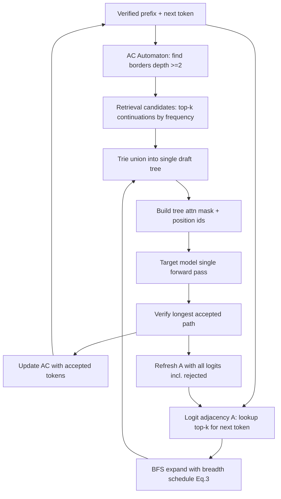

## TL;DR

RACER is a training-free speculative decoding method that merges two weak draft signals — exact n-gram retrieval from recent context, and recycled top-k logits from prior decoding steps — into a single pruned draft tree. The retrieval side provides high-confidence structural anchors; the logits side fills remaining draft budget with model-predicted extrapolations. On Spec-Bench, HumanEval, and MGSM-ZH, the combined draft yields roughly 2.2–2.5× wall-clock speedup over autoregressive decoding, beating other model-free baselines and, on several models, matching or exceeding trained draft models like EAGLE-3 in end-to-end throughput.

## Why this matters

Autoregressive decoding is the dominant latency bottleneck for LLM serving. Speculative decoding (SD) addresses this by drafting tokens cheaply and verifying them with the target model in a single parallel forward pass. The training-free variants split cleanly into two camps: retrieval-based drafts (PLD, REST, SAM) that look up exact n-gram continuations from context or a corpus, and logits-based drafts (Token Recycling, LogitSpec) that reuse past top-k distributions from the target model itself. Each camp has a clean failure mode — retrieval is silent when no exact match exists, and logits-only expansion has no structural prior to anchor long drafts.

RACER's contribution is modest but clean: combine the two signal sources into one tree, with the retrieval side getting first pick of the draft budget and the logits side filling the rest. There is no new model, no extra training, and no specialized kernels. The result is a plug-and-play module that works across model families (Vicuna, LLaMA-3.1, OpenPangu, Qwen3) and tasks (general chat, code, Chinese math).

The honest scope: this is a well-engineered combination of known ideas rather than a new paradigm. The gains over prior model-free methods are real but incremental (roughly 0.2–0.5× speedup improvement over Token Recycling). Against trained draft models like EAGLE-3, RACER loses on mean accepted tokens but often wins on end-to-end speedup because its drafting overhead is near-zero — useful when model-based draft training data doesn't match your target language or domain.

## Background

**Speculative decoding mechanics.** Given a verified prefix, a cheap drafter proposes γ candidate tokens. The target model runs one parallel forward pass over the prefix + drafts, producing logits at each position. Tokens are verified left-to-right; the first rejected position terminates the round, with that position's target logits used to resample. Each round produces at least one token and at most γ+1, so the speedup depends entirely on how often drafts are accepted.

**Tree attention.** Instead of a linear draft, drafts can form a tree where each node is a candidate token and siblings compete at the same position. A custom attention mask restricts each node to its ancestors, and position IDs are set by depth. Verification then selects the longest accepted path. This lets the drafter hedge across multiple plausible continuations per step.

**Prior work this directly builds on:**
- **PLD (Saxena, 2023)** — Matches past n-grams in the context and emits the following m-gram. Simple, effective on repetitive domains, fails on novel continuations.
- **REST (He et al., 2023)** — Suffix-array retrieval over an external corpus, expanded into a trie. Adds coverage but depends on the corpus matching the task distribution.
- **Token Recycling (Luo et al., 2025)** — Maintains a rolling top-k adjacency matrix from past target logits, and expands drafts through a fixed template tree. No retrieval; logits only.
- **LogitSpec (Liu et al., 2025b)** — Uses last-step logits to seed the first draft token and adds retrieval on top. Closest in spirit to RACER but with a less structured integration.
- **Aho–Corasick automaton (Aho & Corasick, 1975)** — Classic multi-pattern matcher: a trie augmented with failure links that jump to the longest proper suffix that is also a prefix of some stored pattern. Enables O(1) amortized transitions per input token.

## The core idea

Two weak drafters with complementary failure modes are better than one. Retrieval gives you tokens you've literally seen before in the right context — these have high confidence but are sparse. Logits give you tokens the model thinks are plausible — these are always available but diffuse. So: spend a fixed draft budget of C nodes. Let retrieval greedily claim as many slots as it can justify from real matches. Let logit-based expansion fill the rest with a pruned beam over top-k candidates. Merge both into one tree via trie union, verify in a single target pass.

Two subtle mechanics make this work. First, for logit expansion, RACER uses **copy-logit** rather than the more natural **last-logit**: when predicting the token at position t+1 whose identity is already committed (say, token x_t was just sampled), RACER reuses the logit distribution from the *last time token x_t appeared* in the sequence, on the theory that the same token in comparable contexts predicts similar successors. Empirically this gives a much sharper acceptance distribution than reusing the last-step logits. Second, retrieval is an Aho–Corasick automaton with a hard node cap and an LRU eviction policy, so memory is bounded regardless of context length.

If you remember nothing else: retrieval anchors, logits extrapolate, shared budget, copy-logit instead of last-logit, LRU-capped automaton.

## The method

### Problem setup

Let the target model be $M_p$ with vocabulary $V$, verified prefix $x_{<t}$, and per-position logits $z_t = f(x_{<t})$. A draft round produces a tree $T$ of candidate tokens (up to $C$ nodes) which is verified in a single forward pass of $M_p$. Under greedy decoding, a draft token $\tilde{x}_i$ is accepted iff it equals $\arg\max p_i$. The goal is to maximize expected accepted path length per round, subject to a fixed draft budget $C$.

### Copy-logit expansion

When extending the draft tree past the sampled next token $x_t$, we don't have $z_{t+1}$. Two surrogates:

- **Last-logit**: $\tilde{z}_{t+1} = z_t$.
- **Copy-logit**: $\tilde{z}_{t+1} = z_{i+1}$, where $i < t$ is the most recent index with $x_i = x_t$.

The authors find copy-logit produces a much heavier-tailed acceptance distribution. On Vicuna-7B with a top-63 expansion, copy-logit's 50th/85th percentile accepted ranks are 1/9, versus 11/37 for last-logit. Rank-1 alone accounts for more than half of accepted cases. Mean accepted tokens rises from 1.57 to 1.87.

Implementation: maintain a rolling top-k adjacency matrix $A \in V \times k$ indexed by token ID. Entry $A[v]$ stores the top-k successor tokens observed when $v$ most recently appeared. When a draft is verified and a new logit is emitted, update $A[x]$ for the corresponding token.

### Logits Tree breadth allocation

RACER builds the logit side of the draft tree breadth-first with a decaying breadth schedule. For a node with breadth $b_i$, child $j$ gets breadth:

$$b_{\text{child}}(i, j) = \max\left(1,\ \left\lfloor \frac{b_i}{2^{j + \mathbb{1}[i \neq 0]}} \right\rfloor\right), \quad j = 0, \ldots, b_i - 1.$$

In words: first-layer nodes inherit full breadth from the root; deeper nodes halve their parent's breadth, and among siblings, later children get exponentially fewer slots. This matches the empirical observation that useful continuations concentrate at the head of the distribution and at shallow tree depths.

Default: root breadth $k = 8$, draft budget $C = 64$. The tree is grown BFS with slots consumed until $C$ runs out.

### Retrieval Tree: Aho–Corasick with LRU

The retrieval side stores n-grams from the running context in an AC automaton with a fixed node budget (default 10,000) and n-gram length cap (default 10).

**Transitions.** Standard AC: on token input, follow the child edge if it exists; otherwise, chase failure links until a valid transition or the root. Every visited state is "touched" in the LRU list, including all prefix ancestors traversed via failure links. This ensures prefixes are always at least as fresh as their extensions.

**Insertion and eviction.** New n-grams are inserted along the transition path. If a new child node must be allocated and the automaton is at capacity, the LRU tail leaf is evicted and reused. Nodes are managed with a hash table + doubly linked list for O(1) touch, insert, and evict. Failure links are rebuilt once at the end of prefill; during incremental insertion, newly added states behave as a plain trie until the next rebuild.

**Expansion (draft generation from retrieval).** At each decoding step, identify all border states (match points) with matched depth ≥ 2. For each border, collect continuations from its sub-trie. Pool continuations across all borders and pick the globally most frequent top-k as retrieval draft candidates.

### Integration

Given budget $C$:

1. Generate retrieval candidates first, up to the most confident ones that fit.
2. Fill remaining budget with Logits Tree expansion using the breadth schedule above.
3. Merge both via trie union into a single draft tree.
4. Build tree attention mask: $\text{mask}[i, j] = \mathbb{1}[j = i \text{ or } j \in \text{ancestor}(i)]$, position IDs by depth.
5. Run one target forward pass and verify longest accepted path.
6. Update the AC automaton with the verified tokens; refresh the logits adjacency matrix with new target logits (including those from rejected draft positions — these still provide useful conditional information for future steps).

### Algorithm sketch

```
for each decoding step:
    borders = AC.all_match_states(min_depth=2)
    retrieval_cands = top_k_by_frequency(union_of_subtries(borders))
    remaining = C - len(retrieval_cands)
    logit_cands = bfs_expand(next_token, adjacency=A,
                             breadth_schedule=Eq.3,
                             budget=remaining)
    draft_tree = trie_union(retrieval_cands, logit_cands)
    logits = target_model.forward(prefix + draft_tree,
                                  tree_attn_mask, tree_pos_ids)
    accepted = verify(draft_tree, logits)
    prefix.extend(accepted)
    AC.insert(accepted)             # update retrieval
    A.update(accepted_logits)       # update adjacency, including rejected slots
```

### Key hyperparameters

| Parameter | Default | Notes |
|---|---|---|
| Draft budget $C$ | 64 | From Medusa; robust in 48–96 range |
| Logits top-k (root breadth) | 8 | Ablations show 8–10 optimal |
| AC node capacity | 10,000 | Stable for 5K–20K |
| Max n-gram length | 10 | Stable for 9–11 |
| LRU eviction | leaves only | Preserves tree integrity |

Ablations show the method is not fragile to these choices — performance varies smoothly around the defaults.

## Architecture



## Results

**Main benchmarks.** RACER is evaluated on Spec-Bench (six sub-tasks: multi-turn, translation, summarization, QA, math, RAG), HumanEval (code), and MGSM-ZH (Chinese math). Target models span Vicuna 7B/13B/33B, LLaMA-3.1-8B, OpenPangu-7B, and Qwen3-8B/14B/32B.

Against model-free baselines (PLD, REST, LogitSpec, Token Recycling), RACER is consistently best or tied-best on average speedup across every target model. Typical average speedups land at 2.2–2.5× over autoregressive decoding. The improvement over Token Recycling — the strongest prior baseline — is roughly 0.2–0.4× speedup on average, coming primarily from the retrieval component on tasks with repeated local patterns (math, RAG, code).

Against EAGLE-3 (a trained draft model, the state of the art for model-based SD), results are more nuanced. On English tasks EAGLE-3 achieves higher MAT (it was trained to predict target tokens, after all), but RACER often matches or beats it on *wall-clock* speedup because it has no draft-model forward cost. On MGSM-ZH, EAGLE-3 collapses to near-baseline speed (1.06–1.18×) — the authors attribute this to English-skewed training data, and it's the single most convincing argument for training-free methods: model-based drafters inherit every distributional weakness of their training set.

**Most convincing experiments.**
1. The copy-logit vs. last-logit comparison. Clean, quantitative, and the resulting heavy-tailed acceptance distribution directly motivates the breadth-allocation rule.
2. The MGSM-ZH result against EAGLE-3. Demonstrates the real cost of depending on a trained drafter when your deployment language or domain drifts.
3. Ablating logits vs. retrieval separately. Removing logits drops speedup by ~0.8× (logits is the backbone); removing retrieval drops by ~0.2× on general tasks but ~0.6× on MGSM-ZH (retrieval is the backbone for reasoning tasks with recurring patterns).

**Interesting ablations.**
- Draft size saturates around 64–80 on the tested hardware. Larger drafts push the system into compute-bound territory where verification cost outweighs acceptance gains — so the optimal $C$ is hardware-dependent, not a universal constant.
- AC node capacity shows strong diminishing returns past ~10K. The long-tail distribution of useful n-grams means a small automaton suffices.
- Temperature ablation (T=0.5, T=1.0 vs. greedy) shows essentially flat speedup across most tasks, meaning RACER's gains are structural rather than depending on a peaky distribution. One exception: OpenPangu on RAG drops from 2.15× to 1.79× under sampling — plausibly because retrieved-context alignment is sensitive to early-token noise.

## Limitations

- **No multimodal evaluation.** Purely text. Whether copy-logit and local n-gram retrieval generalize to vision or speech tokens is untested.
- **Batch size 1 only.** All experiments use `batch_size=1`. Real serving runs batched, and model-free methods do have scaling advantages here (no per-sequence draft model overhead), but this is asserted rather than measured.
- **MAT ceiling vs. trained drafters.** Against EAGLE-3, RACER consistently has lower mean accepted tokens on English tasks. Its wall-clock win comes from zero draft cost, which depends on the draft model being non-trivially expensive. If the target model is large enough that draft overhead is negligible and EAGLE-3's MAT advantage dominates, RACER will lose.
- **Retrieval is pure n-gram frequency.** No semantic similarity, no learned ranking. In domains with low lexical repetition (open-ended chat, creative writing), the retrieval branch degenerates and the method reduces to an incrementally better Token Recycling.
- **Copy-logit assumption.** The claim that "same token in comparable contexts has similar successors" breaks down for highly polysemous tokens or punctuation used in very different syntactic roles. The ablations don't stratify acceptance by token type, so it's unclear where this assumption fails.
- **LRU eviction heuristic.** Leaf-only eviction preserves structure but has no semantic notion of value — a rare-but-important n-gram can be evicted simply by going unused for a while, even if it's about to become relevant again.
- **Single-GPU, fp16 only.** No results with quantization, tensor parallelism, or production inference stacks (vLLM, TensorRT-LLM). Integration cost into those is unknown.

## Reimplementation notes

**Core components you need to build:**
1. A top-k adjacency matrix keyed by token ID, updated each decoding step with both accepted and rejected-position logits.
2. An Aho–Corasick automaton with LRU eviction. Hash table + doubly linked list. Amortized O(1) per operation. Failure links rebuilt once at end of prefill; incremental insertions behave as a plain trie until next rebuild.
3. A BFS tree-builder implementing the breadth schedule in Eq. 3.
4. Trie-union merging of retrieval and logits drafts.
5. Tree attention mask + position ID construction, consistent with the target model's attention implementation.

**Gotchas:**
- Copy-logit requires tracking the last position each token appeared at — easy, but integrate it with the adjacency matrix update rather than as a separate structure.
- When retrieval borders overlap (multiple matched suffixes), de-duplicate continuations before the top-k selection or you'll overcount frequencies.
- The tree attention mask must exactly match the target's attention kernel. Flash-attention variants sometimes need custom masks; HF eager attention is simplest for prototyping.
- "Refresh logits adjacency including rejected positions" matters. The ablation curve (with vs. without using rejected logits for future expansion) shows meaningful acceptance gains from using them.
- Failure-link rebuild after prefill is a one-time BFS over the automaton — don't redo this per decoding step.

**Compute.** Evaluation uses a single RTX 4090 (7B/8B models) or a single A800 80GB (13B+). No training. Reproducing the full benchmark sweep is maybe 100–300 GPU-hours depending on models included — most of that is the verification forward passes, not the method itself.

**Code.** Authors release source at `github.com/hkr04/RACER`. Integration targets HuggingFace Transformers (4.37.x for Vicuna, 4.52.x for newer models).

**Effort estimate.** A competent engineer who has implemented speculative decoding before should get a working prototype in roughly 3–5 days: 1 day for the AC+LRU automaton, 1 day for the adjacency matrix and copy-logit bookkeeping, 1 day for tree construction and merging, 1–2 days for tree attention integration and debugging. Getting it to match paper numbers is another week of tuning and benchmarking.

## Related reading

- **Leviathan et al. (2023), "Fast Inference from Transformers via Speculative Decoding"** — The canonical SD formulation. Essential background.
- **Cai et al. (2024), "Medusa"** — Introduces the tree attention + fixed template draft tree that RACER's draft budget convention (C=64) inherits.
- **Luo et al. (2025), "Token Recycling"** — Direct precursor to RACER's logits branch. The top-k adjacency matrix idea originates here.
- **He et al. (2023), "REST"** — Retrieval-based SD with suffix arrays; establishes the retrieval-drafter baseline.
- **Li et al. (2025), "EAGLE-3"** — State-of-the-art model-based SD. Useful comparison point for understanding the trade-off between trained drafters and training-free methods.

## Key equations

**Speculative acceptance ratio (Leviathan et al.).**
$$\alpha_i = \min\left(1, \frac{p_i[\tilde{x}_i]}{q_i[\tilde{x}_i]}\right)$$
Probability of accepting draft token $\tilde{x}_i$ under the standard rejection-sampling verification.

**Breadth allocation for the Logits Tree.**
$$b_{\text{child}}(i, j) = \max\left(1,\ \left\lfloor b_i / 2^{j + \mathbb{1}[i \neq 0]} \right\rfloor\right)$$
Halving-with-bias schedule that concentrates draft budget at shallow depths and top-ranked siblings.

**Copy-logit surrogate.**
$$\tilde{z}_{t+1} = z_{i+1}, \quad i = \max\{j < t : x_j = x_t\}$$
Reuse the successor distribution from the last occurrence of the same token.

**Tree attention mask.**
$$\text{mask}[i, j] = \mathbb{1}[j = i \text{ or } j \in \text{ancestor}(i)]$$
Lets every candidate attend only to its own path — the mechanic that makes tree drafts verifiable in one forward pass.