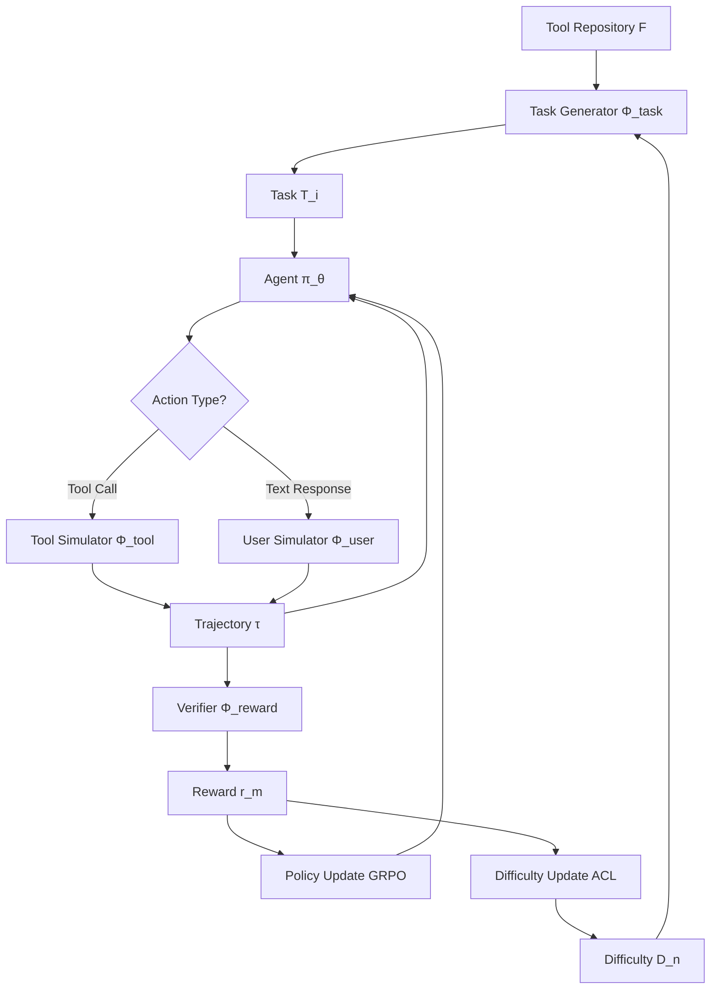

## TL;DR

Training tool-calling agents typically requires expensive annotated data or commercial LMs for environment simulation. TRUSTEE demonstrates that a single 8B open-source language model can simulate all environment components (tasks, users, tools, verifiers) while adaptively controlling task difficulty during training. The method outperforms baselines that use real data or GPT-4 synthesized environments, proving that sophisticated simulation design can substitute for expensive resources.

## Why this matters

Current approaches to training LM agents for tool use face a fundamental bottleneck: creating realistic training environments at scale. Most methods either rely on static datasets with ground truth annotations (limiting diversity and requiring expensive human labeling), or use commercial LMs like GPT-4 to synthesize environments (adding substantial API costs and dependency on proprietary models). The environments generated are typically fixed after creation, making them either too easy for strong agents or impossibly difficult for weak ones.

TRUSTEE breaks this dependency by showing that even modest-sized open models can create sufficiently rich training environments when paired with adaptive curriculum learning. The method uses the same 8B parameter model (Qwen3-8B) for both the agent being trained and all simulation components, eliminating external dependencies entirely. By dynamically adjusting task difficulty based on agent performance, the system maintains an optimal learning gradient throughout training.

This matters because it democratizes agent training - teams without access to large annotation budgets or commercial API credits can still build competitive tool-calling systems. More broadly, it suggests that the key to scaling agent capabilities may lie not in larger models or more data, but in more sophisticated simulation and curriculum design.

## Background

The paper builds on three key developments in agent learning:

**Reinforcement Learning from Verifiable Rewards (RLVR)**: Methods like ToolRL and Tool-N1 that use offline datasets with ground truth to provide reward signals for single-turn tool calling optimization.

**Simulated environments for multi-turn training**: Simia-RL pioneered using LMs to simulate tool responses during online interaction, though still requiring fixed task datasets as input.

**Programmatic environment synthesis**: EnvScaler and AWM generate executable environments (code + databases) using commercial LMs, creating verifiable but static training scenarios.

Prerequisites for understanding this work include familiarity with POMDP formulations of sequential decision making, policy gradient methods (specifically GRPO), and the distinction between single-turn function calling (one tool invocation) versus multi-turn agent-user dialogues with multiple tool uses.

## The core idea

Think of training a tool-calling agent like teaching someone to cook in a kitchen. Traditional approaches either give them a cookbook with fixed recipes (supervised learning on static data) or hire an expensive chef to create custom scenarios (using GPT-4 for synthesis). TRUSTEE instead creates a "holographic kitchen" where everything - the recipes, the ingredients' behavior, the taste tester, and even the difficulty of dishes - is simulated by the same AI system that's learning to cook.

The key insight is that the simulator doesn't need to be perfect or even particularly sophisticated - it just needs to be consistent enough to provide learning signal, and adaptive enough to keep pace with the learner. As the agent improves at simple tasks (boiling water), the curriculum automatically advances to harder challenges (making soufflé), with all components of difficulty scaling together: more tools available, more interaction turns required, vaguer user instructions, and stricter evaluation criteria.

## The method

### Problem Formulation

The tool-calling task is formalized as a Partially Observable Markov Decision Process (POMDP):

$$\langle S, A, P, R, \gamma, O \rangle$$

where:
- $S$ is the state space (hidden environment state)
- $A = A_{text} \cup A_{tool}$ combines textual responses and tool calls
- $P(s_{t+1}|s_t, a_t)$ defines state transitions
- $R(s_t, a_t)$ provides rewards
- $\gamma$ is the discount factor
- $O$ maps states to observations

The agent with parameters $\theta$ observes $o_t = O(s_t)$, takes action $a_t \sim \pi_\theta(o_t)$, and aims to maximize the final reward:

$$J(\theta) = \mathbb{E}_{\tau \sim \pi_\theta}[r_\tau]$$

### Three-Stage Training Loop

**Stage 1: Task Generation**

For each task $T_i$ at training step $n$:
1. Sample tool subset: $F_i = \text{Sample}(F, D_n)$ where $D_n$ is current difficulty
2. Generate task via LM: $T_i = \Phi_{task}(F_i, D_n) = (p_i, g_i, q_i, c_i)$
   - $p_i$: user persona description
   - $g_i$: user intent (ground truth goal)
   - $q_i$: initial user query
   - $c_i$: expected tool calls

**Stage 2: Environment Simulation**

For each trajectory, the agent interacts with simulated components:

```
Agent action: a_t = π_θ(o_t, F_i)
If tool call: f_t = Φ_tool(τ, F_i, g_i)  
If text response: u_t = Φ_user(τ, F_i, g_i, p_i)
Update trajectory: τ = τ ⊕ response
```

The simulators $\Phi_{tool}$ and $\Phi_{user}$ are both instantiated by the same 8B LM with task-specific prompts.

**Stage 3: Reward and Optimization**

Final trajectory evaluation:
$$r_m = \Phi_{reward}(\tau_m, F_i, g_i, p_i, c_i, D_n)$$

Returns {-1, 0, 1} based on criteria satisfaction. Optimization uses GRPO with token-level loss:

$$J_{GRPO}(\theta) = \frac{1}{Z} \sum_{m=1}^M \sum_{t=0}^{T_m-1} \sum_{j=1}^{|a_t|} \left[ \text{CLIP}(r_{m,t,j}(\theta), \hat{A}_{m,t,j}, \epsilon) - \beta D_{KL}(\pi_\theta || \pi_{ref}) \right]$$

where $\hat{A}_{m,t,j}$ is the group-relative advantage computed from final rewards only.

### Adaptive Curriculum Learning (ACL)

The difficulty $D_n$ evolves based on average batch reward $\bar{r}_n$:

$$D_{n+1} = \begin{cases}
D_n + \delta & \text{if } \bar{r}_n > \eta_{high} \\
D_n - \delta & \text{if } \bar{r}_n < \eta_{low} \\
D_n & \text{otherwise}
\end{cases}$$

Seven difficulty aspects scale with $D_n$ (range 1-100):

1. **Number of available tools**: 1-10 tools sampled
2. **Expected tool callings**: 1-3 calls required
3. **Interaction turns**: 1-2 expected turns (max scales accordingly)
4. **System prompt specificity**: Detailed instructions → generic "You are a helpful assistant"
5. **User persona**: Expert → Beginner → Novice
6. **Query ambiguity**: Clear → Somewhat ambiguous → Highly ambiguous  
7. **Evaluation criteria**: Progressively stricter (intent → correct tools → no hallucination → no redundancy → efficiency)

To maintain diversity, each task has probability $\epsilon = 0.5$ of randomly sampling aspects within current difficulty bounds rather than using fixed values.

### Key Hyperparameters

- Learning rate: 1e-6
- Training steps: 200
- Batch size: 16 tasks
- Group size for GRPO: 8
- KL coefficient: 0.001
- Clip ratio: 0.2
- Difficulty step size $\delta$: 3
- Reward thresholds: $\eta_{low} = 0.0$, $\eta_{high} = 0.5$

## Architecture



## Results

TRUSTEE achieves the strongest overall performance across both single-turn and multi-turn benchmarks despite using no external resources:

**Single-turn tool calling (BFCL)**: TRUSTEE reaches 89.7% average on Non-Live tasks and 82.2% on Live tasks, outperforming all baselines including those using annotated data (ToolRL: 88.8%/81.2%) and synthesized environments (EnvScaler: 87.4%/81.2%). Notably, it's the only method showing consistent improvements across all subtask categories.

**Multi-turn interaction**: On BFCL Multi-Turn, TRUSTEE achieves 46.4% average accuracy versus 44.5% for the next best (EnvScaler). The Simia baseline, specifically tuned for multi-turn scenarios, catastrophically fails with only 2.0% accuracy due to overfitting.

**Real-world scenarios (τ2-bench)**: TRUSTEE is the only method improving performance on all three domains (Airline: 26.0%, Retail: 45.6%, Telecom: 17.5%), while every baseline degrades on at least one domain. The Telecom domain proves particularly challenging for all baselines, with most dropping below the base model's 15.8% accuracy.

The most convincing result is TRUSTEE's consistent improvement pattern - unlike baselines that show erratic performance across different evaluation aspects, it maintains steady gains. This suggests the adaptive curriculum successfully prevents both underfitting and catastrophic forgetting.

## Limitations

The simulation quality is fundamentally bounded by the 8B model's capabilities. When tasks involve many tools (>10) or extended interactions (>5 turns), the simulator may generate inconsistent rewards or unrealistic tool responses, degrading the learning signal.

The method requires extensive hyperparameter tuning, particularly for the curriculum pacing parameters. The paper doesn't provide ablations on these choices, making it unclear how sensitive performance is to specific values of $\delta$, $\eta_{low}$, $\eta_{high}$, and the soft curriculum probability $\epsilon$.

Simulation failures cause significant trajectory abortion - the LM simulator sometimes generates malformed responses that crash the interaction. The paper doesn't quantify this failure rate or its impact on sample efficiency.

The evaluation is limited to existing tool-calling benchmarks which may not capture all failure modes of fully simulated training. There's no analysis of whether agents trained this way exhibit specific biases or gaps compared to those trained on real data.

## Reimplementation notes

The core challenge is managing the concurrent simulation and training setup. You need 8 GPUs total: 4 for agent training via veRL, 4 for running the vLLM server hosting the simulation LM.

The tool repository comes from ToolBench's REST API collection (49 categories from RapidAPI). These are just text descriptions - no actual executable endpoints needed.

Major implementation gotchas:
- Batch size is limited to 16 to prevent vLLM server overload from concurrent simulation requests
- Tool sampling prioritizes same-category tools to maintain coherence
- Prompt templates are crucial - the paper provides full templates in appendix

Compute requirements: ~200 training steps on 8x NVIDIA H20 GPUs (roughly 24-48 GPU-hours total).

A solo engineer could likely get a working prototype in 2-3 weeks, assuming familiarity with RLHF codebases. The main effort is in prompt engineering for simulators and debugging the asynchronous simulation-training loop.

## Production implementation

**Tech stack**: Python with veRL for distributed training, vLLM for simulation serving, Ray for orchestration. Model checkpoints stored in S3 with Weights & Biases for experiment tracking. Production inference via TensorRT-LLM for the trained agent, with simulation components retired post-training.

**Data pipeline**: 
- Training time: Pull tool descriptions from versioned JSON in S3 → Task generator creates scenarios on-the-fly → Trajectories logged to distributed storage for replay/analysis
- Inference time: User query → TensorRT-LLM agent → Tool router (maps to real APIs) → Response formatting → User

**Deployment shape**: Online service with 50ms P50 latency target for tool selection, 200ms P95 for complete response. Single A100 40GB handles ~100 QPS at batch size 8 for the 8B agent model. Simulation infrastructure only needed during retraining cycles.

**Failure modes in production**:
- Tool drift: Real APIs change faster than retraining cycles → Implement tool description versioning with fallback to semantic-similarity matching
- Hallucinated tools: Agent invents non-existent functions → Strict validation layer rejecting any tool call not in current registry
- Simulation artifacts: Agent expects specific response patterns from training → Add response normalization layer and diversity injection during training
- Cost explosion from recursive tool calling → Hard limit of 10 tool calls per conversation, with exponential backoff

**Evaluation plan**: 
- Offline: Hold-out test set with real tool execution for accuracy, plus adversarial prompts for robustness
- Online: A/B test measuring task completion rate, user satisfaction (thumbs up/down), and tool call efficiency
- Never ship: Agent calling privileged tools without user confirmation (payment, data deletion, etc.)

**Rollout strategy**: Shadow mode for 1 week comparing to current system → 5% traffic with strict error monitoring → 25% if error rate <1% → Full rollout with automated rollback trigger on >2% error rate spike.

**Cost envelope**: Training costs ~$200 per full run on cloud GPUs. Inference at $0.002 per 1K tokens translates to ~$0.01 per complex multi-turn interaction. Cost ceiling at $0.10 per user per day triggers model quantization and caching optimizations.

## Related reading

- **GRPO (DeepSeekMath)**: The policy optimization algorithm used, providing stable token-level RL updates
- **ToolBench**: Source of the 16,000+ tool descriptions used for training, spanning 49 API categories
- **τ-bench**: Realistic multi-turn evaluation benchmark that exposed overfitting in baseline methods
- **Simia-RL**: Prior work on LM-simulated tool responses, though limited to fixed task datasets
- **veRL**: The distributed RLHF training framework that enables the agent-simulator architecture

## Key equations

**Adaptive difficulty update**: $D_{n+1} = D_n + \delta \cdot \text{sign}(\bar{r}_n - \eta_{threshold})$ - Maintains optimal challenge level throughout training

**GRPO advantage**: $\hat{A}_{m,t,j} = \frac{r_m - \text{Mean}(\{r_m\})}{\text{Std}(\{r_m\})}$ - Group-relative normalization for stable gradients

**Task generation**: $T_i = \Phi_{task}(F_i, D_n) = (p_i, g_i, q_i, c_i)$ - Fully parameterized task creation from tools and difficulty

**Simulation cascade**: $\tau_{t+1} = \tau_t \oplus \Phi_{env}(\tau_t, F_i, g_i, p_i)$ - Recursive trajectory building through simulated interaction