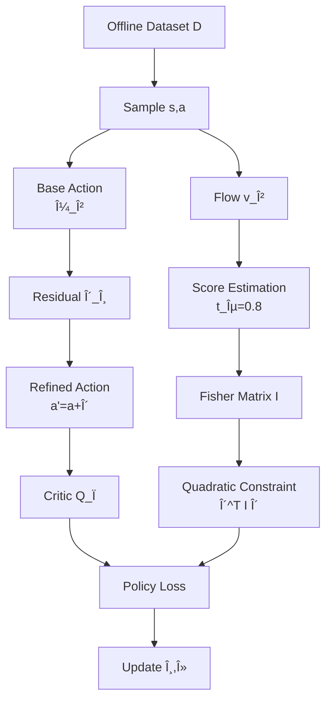

## TL;DR

Offline reinforcement learning with flow-based policies suffers from a geometric mismatch: existing methods use isotropic L2 regularization that ignores the anisotropic structure of behavioral distributions. This paper introduces Fisher Decorator (FiDec), which parameterizes policy refinement as a local transport map constrained by the Fisher information metric derived from the flow's velocity field. The method achieves state-of-the-art performance on 73 offline RL tasks while maintaining computational efficiency comparable to existing flow policies.

## Why this matters

Current flow-based offline RL methods like Flow Q-learning (FQL) have achieved strong performance by using flow matching to model complex multimodal behavioral policies. However, they face a fundamental theoretical problem: offline RL requires KL-constrained optimization to prevent distributional shift, but practical implementations resort to L2 regularization (or upper bounds of 2-Wasserstein distance) as a tractable surrogate. This substitution is problematic because KL divergence is inherently anisotropic and density-aware—it heavily penalizes deviations in high-probability regions while being more lenient in low-density areas. In contrast, L2 regularization treats all directions uniformly regardless of the underlying distribution.

This mismatch leads to three critical failures in practice. First, policies can drift into unsupported regions because L2 penalties don't enforce the strict support constraints that KL divergence provides. Second, in multimodal settings, isotropic regularization causes mode averaging, where the policy collapses toward intermediate low-value regions between modes. Third, policy updates are misaligned with the true geometric structure of the behavioral distribution, leading to suboptimal convergence.

This work bridges the gap between theoretical requirements and practical implementation by deriving a tractable anisotropic optimization framework that respects the underlying geometry. The contribution is particularly relevant for real-world offline RL applications where behavioral data is complex, multimodal, and where out-of-distribution actions can be catastrophic.

## Background

The paper builds on flow matching for generative modeling, which trains continuous normalizing flows via simple regression objectives rather than maximum likelihood. In the RL context, flow models parameterize policies by learning a velocity field v_β(t, s, a) that transforms Gaussian noise into actions following the behavioral distribution. Key prerequisite concepts include:

**Transport maps and pushforward measures**: A transport map T transforms one probability distribution into another. The pushforward measure (T)#π describes how probability mass moves under the transformation, with density changes governed by the Jacobian determinant.

**Fisher information matrix**: In information geometry, this matrix captures the local curvature of probability distributions. For a distribution with score function ∇log π, the local Fisher information at point a is I(a) = ∇log π(a) · ∇log π(a)^T, forming a rank-1 matrix that encodes directional sensitivity.

Three key prior works:
- **Flow Q-learning (Park et al., 2025)**: Distills iterative flow models into one-step generators for tractable policy optimization but uses L2 regularization
- **DeFlow (Mu, 2026)**: Adds residual refinement to flow policies but still relies on the same problematic L2 constraint  
- **Offline RL foundations (Levine et al., 2020)**: Established KL-constrained optimization as the principled framework for offline RL

## The core idea

Think of policy refinement like nudging marbles on a curved surface. The behavioral policy defines where marbles currently sit (the data distribution). We want to push them toward higher-value regions, but we can't push too hard or they'll fall off the surface (distributional shift).

Existing methods treat the surface as flat, applying uniform force in all directions (isotropic L2 penalty). But the actual surface has hills and valleys—some directions have steep gradients (high probability density) while others are nearly flat (low density regions). Pushing against a steep gradient requires more force and risks the marble sliding back, while pushing along flat regions is easier but might lead the marble off the edge.

FiDec solves this by feeling the local curvature at each point through the Fisher information metric. Instead of learning an entirely new policy, it learns a small displacement field δ(s,a) that shifts each action: a' = a + δ(s,a). The key insight: the score function (gradient of log-density) needed to compute the Fisher metric is already encoded in the flow's velocity field through the relation:

$$\nabla_a \log \pi_\beta(a|s) = \lim_{t \to 1} \frac{t v_\beta(t,s,a) - a}{1-t}$$

By constraining the displacement using this geometry-aware metric rather than naive L2, the method achieves anisotropic updates that preserve multimodality and respect the support.

## The method

### Problem Setup

Given offline dataset D with behavioral policy π_β, the goal is to learn policy π_θ that maximizes expected Q-values while staying close to π_β:

$$\max_{\pi_\theta} \mathbb{E}_{s \sim D, a \sim \pi_\theta}[Q_\phi(s,a)] \quad \text{s.t.} \quad \mathbb{E}_s[D_{KL}(\pi_\theta(\cdot|s) \| \pi_\beta(\cdot|s))] \leq \epsilon$$

The behavioral policy π_β is parameterized via flow matching with velocity field v_β(t, s, a) that solves:
$$\frac{d}{dt}\psi_\beta(t,x) = v_\beta(t, \psi_\beta(t,x))$$

transforming Gaussian noise at t=0 to the target distribution at t=1.

### Transport Map Parameterization

Instead of learning a new flow from scratch, FiDec parameterizes the refined policy via a local transport map:

$$T_s(a) = a + \delta_\theta(s,a)$$

where δ_θ is a learned residual network. The refined policy is the pushforward:
$$\pi_\theta(\cdot|s) = (T_s)_\# \pi_\beta(\cdot|s)$$

### KL Divergence Approximation

Under small displacements, the KL divergence admits a second-order Taylor expansion:

$$D_{KL}(\pi_\theta \| \pi_\beta) \approx \frac{1}{2}\mathbb{E}_{a \sim \pi_\beta}[\delta(s,a)^T I(s,a) \delta(s,a)]$$

where the local Fisher information matrix is:
$$I(s,a) = \nabla_a \log \pi_\beta(a|s) \cdot \nabla_a \log \pi_\beta(a|s)^T$$

### Score Function Estimation

The score function is extracted from the velocity field using a perturbed time t_ε = 1 - ε:

$$I(s,a) \approx \frac{(t_\epsilon v_\beta(t_\epsilon, s, a) - a)(t_\epsilon v_\beta(t_\epsilon, s, a) - a)^T}{(1-t_\epsilon)^2}$$

The optimal perturbation scales as ε* ~ O(δ^{1/6}) where δ is machine precision. In practice, ε ∈ [0.7, 0.8] works well.

### Optimization Objective

The constrained problem becomes a Lagrangian:

$$\mathcal{L}(\delta_\theta, \lambda) = \mathbb{E}_{s,a}[Q_\phi(s, a + \delta_\theta(s,a))] - \lambda\left(\mathbb{E}_{s,a}\left[\frac{1}{2}\delta_\theta^T I(s,a) \delta_\theta\right] - \epsilon\right)$$

**Critical hyperparameters:**
- Perturbed time t_ε = 0.8 (for Fisher estimation)
- Trust region threshold ε = 0.001 to 0.01 (task-dependent)
- Flow integration steps: 10
- Network architecture: 4-layer MLP with 512 hidden units
- Dual variable learning rate η = 3e-4

### Algorithm

```
Initialize: behavioral flow v_β, critic Q_φ, residual network δ_θ, dual variable λ
for each iteration:
    # Sample batch
    Sample (s, a, r, s') ~ D
    
    # Update critic (standard TD learning)
    Update Q_φ via TD error
    
    # Train behavioral flow 
    Sample t ~ Uniform[0,1], z ~ N(0,I)
    x_t = (1-t)z + t*a
    Loss_flow = ||v_β(t,s,x_t) - (a-z)||²
    
    # Estimate Fisher information
    t_ε = 0.8
    score = (t_ε * v_β(t_ε,s,a) - a) / (1-t_ε)
    I(s,a) = score * score^T / trace(score * score^T)  # normalized
    
    # Update transport map
    a_refined = a + δ_θ(s,a)
    Loss_actor = -Q_φ(s, a_refined) + λ/2 * δ_θ^T I(s,a) δ_θ
    
    # Update dual variable
    constraint_violation = E[1/2 * δ_θ^T I(s,a) δ_θ] - ε
    λ = ReLU(λ + η * constraint_violation)
```

The trace normalization of I(s,a) improves numerical stability without changing the optimization landscape since Fisher information is rank-1.

## Architecture



## Results

The method achieves state-of-the-art performance across 73 tasks spanning OGBench and D4RL benchmarks. Key findings:

**Offline performance**: FiDec outperforms all baselines including recent flow methods (FQL, DeFlow) with particularly strong gains on multimodal tasks. On challenging OGBench environments like Humanoid (72% vs 57% for DeFlow), Puzzle-3x3 (43% vs 24%), and Antsoccer (64% vs 62%), the anisotropic updates preserve complex behavioral modes while steering toward high-value regions.

**Offline-to-online transfer**: Without modification, FiDec fine-tunes effectively online, reaching 99-100% success rates on navigation tasks where FQL plateaus at 84-86%. The geometric awareness enables faster adaptation by allowing larger updates in low-density directions.

**Key ablations reveal**:
- Using isotropic L2 instead of Fisher metric drops performance by 30% on average (51% vs 36% across 5 tasks)
- The perturbed time t_ε = 0.8 is optimal; values outside [0.7, 0.9] degrade significantly
- Training overhead is minimal: 2.72ms/step vs 2.13ms for FQL

The most convincing experiments are the visualizations showing policy evolution on multimodal landscapes. While FQL collapses modes and DeFlow interpolates through low-value regions, FiDec maintains multimodality while shifting mass toward favorable areas—directly validating the theoretical predictions about anisotropic vs isotropic regularization.

## Limitations

The method has several important limitations:

1. **Dependence on flow quality**: The Fisher information estimate relies on accurate velocity fields. If the behavioral flow is poorly trained or the distribution has extreme complexity, the score estimation degrades.

2. **Small displacement assumption**: The second-order KL approximation requires ||δ|| to be small. For policies that need large corrections, multiple refinement stages might be necessary.

3. **Computational overhead**: While efficient compared to diffusion policies, the method still requires training and storing a flow model plus residual network—roughly 2x the parameters of a standard Gaussian policy.

4. **Limited to continuous actions**: The transport map formulation assumes differentiable transformations in continuous action spaces. Discrete or hybrid action spaces would require different approaches.

5. **Hyperparameter sensitivity**: Despite theoretical guidance, the perturbed time t_ε still requires tuning. The suggested [0.7, 0.8] range may not be optimal for all distributions.

The evaluation could be stronger with: (a) analysis on genuinely multimodal real-world datasets beyond synthetic benchmarks, (b) comparison of actual KL divergence vs the quadratic approximation, (c) robustness tests under dataset shift or corrupted demonstrations.

## Reimplementation notes

**Implementation gotchas:**
- The Fisher matrix is rank-1 so store as outer product of score vector, not full matrix
- Trace normalization is crucial for numerical stability
- Stop gradients through the behavioral flow when updating the residual network
- Use log(λ) parameterization for the dual variable to maintain positivity

**Compute requirements**: Roughly 24 GPU-hours on a single A100 for convergence on Humanoid tasks (2M gradient steps). Comparable to FQL/DeFlow.

**Codebase**: Authors promise code at github.com/ARC0127/Fisher-Decorator (not yet available). The method builds on standard flow matching implementations—any conditional flow codebase (e.g., concurrent work's flow matching repos) provides a starting point.

**Effort estimate**: For a solo engineer with RL experience: 2-3 weeks to get basic working prototype given existing flow matching code, another 2 weeks for tuning and debugging the Fisher estimation. The main challenges are numerical stability in score estimation and proper gradient routing through the transport map.

## Production implementation

**Tech stack**: PyTorch or JAX for training, ONNX export for inference. Model serving via Triton Inference Server with TensorRT optimization for the flow ODE solver. Redis for caching frequently accessed Fisher matrices. MLflow for experiment tracking and model versioning.

**Data pipeline**: 
- Training: Parquet files on S3 → Spark preprocessing → TFRecord sharding → PyTorch DataLoader with prefetching
- Inference: Raw observations → normalization layer → parallel base flow + residual forward passes → action clipping → environment step

**Deployment shape**: Online service with 50ms latency budget for robotics control at 20Hz. Single A100 40GB handles ~200 QPS with batch size 32. For cost-sensitive deployments, quantize to FP16 and run on 4x T4 GPUs.

**Failure modes in production**:
- **Distribution shift**: Monitor KL divergence between recent actions and training distribution. If KL > 2x threshold, fall back to behavioral cloning
- **Numerical instability**: Detect NaN/Inf in Fisher matrices, fall back to identity matrix (isotropic) temporarily
- **Flow divergence**: If ODE solver fails to converge in 20 steps, return behavioral policy action
- **Adversarial inputs**: Clip observations to training data range, reject actions with ||δ|| > 3σ

**Evaluation plan**:
- Offline: Track empirical KL divergence, action MSE, and Q-value estimates on held-out validation set
- Online A/B: Primary metric is task success rate, guardrails on safety violations and OOD action rate
- Never ship: Policy that assigns >1% probability mass outside behavioral support on safety-critical dimensions

**Rollout strategy**: 
1. Shadow mode for 1 week comparing actions (not executing)
2. 5% traffic with instant rollback trigger on safety violations
3. Ramp 5% → 25% → 50% → 100% over 2 weeks
4. Monitor OOD action rate; rollback if >5% actions have ||δ|| > 2σ

**Cost back-of-envelope**: 
- Inference: ~$0.08/1K requests on A100 spot instances
- Training: $500/model update on full dataset
- Storage: $50/month for model versions and Fisher matrix cache
- Cost ceiling at $10K/month → trigger model distillation to smaller architecture

## Related reading

- **"Offline Reinforcement Learning: Tutorial, Review, and Perspectives on Open Problems" (Levine et al., 2020)**: Foundational work establishing KL-constrained optimization as the principled framework for offline RL
- **"Flow Matching for Generative Modeling" (Lipman et al., 2022)**: Core technique for training continuous normalizing flows via simple regression
- **"Information Geometry and its Applications" (Amari, 2016)**: Mathematical foundations for understanding Fisher information and statistical manifolds
- **"Optimal Transport: Old and New" (Villani, 2009)**: Theoretical background on Wasserstein distances and transport maps
- **"Flow Q-learning" (Park et al., 2025)**: Direct predecessor using flow models for offline RL policies

## Key equations

**Transport map policy refinement**:
$$T_s(a) = a + \delta_\theta(s,a)$$
Defines how actions are locally adjusted rather than regenerated

**KL divergence quadratic approximation**:
$$D_{KL}(\pi_\theta \| \pi_\beta) \approx \frac{1}{2}\mathbb{E}_{a \sim \pi_\beta}[\delta^T I(s,a) \delta]$$
Links transport displacement to KL constraint via Fisher information

**Score function from velocity field**:
$$\nabla_a \log \pi_\beta(a|s) = \lim_{t \to 1} \frac{t v_\beta(t,s,a) - a}{1-t}$$
Extracts geometric information already encoded in the flow

**Optimal displacement under Fisher metric**:
$$\delta^*(s,a) \approx \frac{1}{\lambda} I(s,a)^{-1} \nabla_a Q_\phi(s,a)$$
Natural gradient update in action space when Fisher information is known