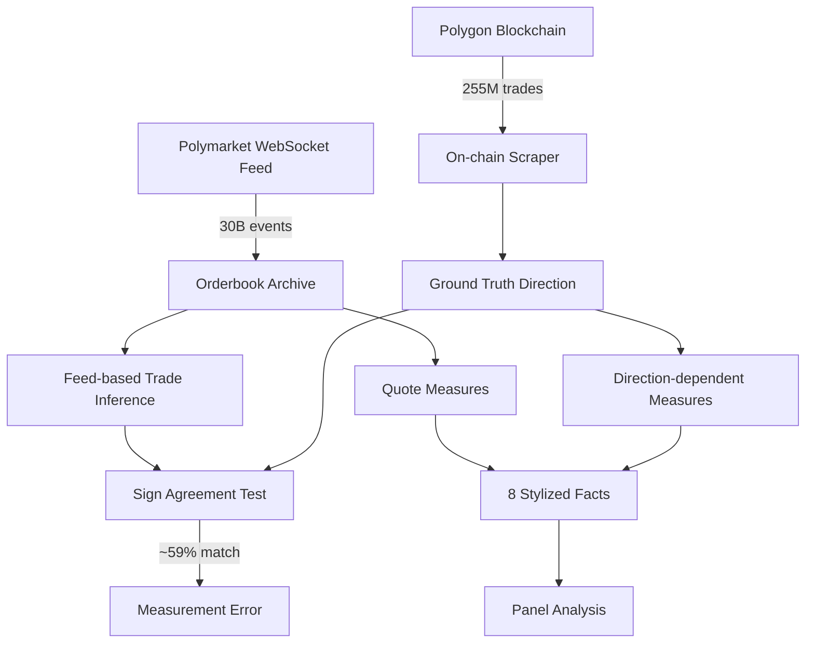

## TL;DR

This paper analyzes 30 billion tick-level orderbook events from Polymarket, finding that trade direction inferred from the public feed agrees with on-chain ground truth only ~59% of the time—barely above random chance. The study documents eight cross-sectional patterns including a longshot spread premium and depth decay near market resolution, but the key finding is that standard microstructure measures like effective spread and Kyle's λ require on-chain data, not the public feed.

## Why this matters

Prediction markets are supposed to aggregate dispersed information into probability-like prices, but this aggregation happens through the microstructure—the actual mechanics of how orders match and spreads form. If spreads are wide or trade direction is misidentified, the resulting prices become noisier and less informative. Most prediction market research has focused on price accuracy and calibration, treating the underlying market mechanics as a black box.

Polymarket has become the largest decentralized prediction market with billions in volume, yet its microstructure remains poorly understood. This paper reveals a critical measurement problem: the public WebSocket feed that researchers typically use doesn't contain enough information to determine which side initiated a trade. Without accurate trade direction, fundamental measures like effective spread, realized spread, and price impact become unreliable or entirely wrong. The paper shows that on two-thirds of liquid markets, the effective spread literally flips sign when switching from feed-inferred to on-chain trade direction.

This isn't just an academic concern. Anyone building trading algorithms, providing liquidity, or studying information aggregation on Polymarket needs accurate microstructure measures. The paper provides both the diagnostic (what's broken) and the cure (how to join on-chain data correctly), along with the first comprehensive cross-sectional analysis of how these markets actually function at the tick level.

## Background

The theoretical framework builds on classical market microstructure work, particularly **O'Hara (1995)** and **Hasbrouck (2007)** who formalized how limit order books aggregate information through the interaction of informed and uninformed traders. For spread decomposition, the paper uses the **Glosten-Harris (1988)** model that separates spreads into transitory (inventory/processing) and permanent (adverse selection) components.

The empirical benchmark is the **Lee-Ready (1991)** algorithm for inferring trade direction from quotes, which achieves ~80% accuracy on equity markets. Prior Polymarket-specific work includes **Tsang and Yang (2026)** who studied the 2024 US election market as a single time series, finding Kyle's λ declined by an order of magnitude as the market matured, and **Rahman et al. (2025)** who surveyed decentralized prediction market microstructure methodologically without bringing matching tick-level data.

Key prerequisites: A limit order book has bids (buy orders) and asks (sell orders) at different price levels. The spread is the gap between best bid and ask. An "aggressor" or "taker" is the trader who crosses the spread to trade immediately against resting orders. Effective spread measures the actual trading cost including price impact. Kyle's λ measures how much prices move per unit of order flow, capturing price impact.

## The core idea

Think of trade direction inference like trying to figure out who started a conversation when you can only see the final positions of two people. On traditional exchanges, you see someone walk across the room (cross the spread) to start talking—that's your aggressor. But Polymarket's public feed only shows you a snapshot after they've already met, with a note saying "the left side of the room changed." You can guess that maybe someone from the right walked over, but you're wrong about 40% of the time.

The paper's core insight is that this ~40% error rate isn't just noise—it systematically corrupts every microstructure measure that depends on knowing who initiated each trade. When you get the direction wrong, you're not just adding random error; you're potentially reversing the sign of important metrics. A market might look like it has a positive spread (market makers earning money) when it actually has a negative spread (market makers losing money to informed traders).

The solution is conceptually simple but practically involved: instead of guessing from the public feed, get the authoritative record from the blockchain where every trade explicitly identifies both parties and who was the aggressor. The paper builds this bridge between the high-frequency orderbook feed (30 billion events) and the on-chain settlement record (255 million trades), then uses it to establish what Polymarket's microstructure actually looks like.

## The method

### Data Architecture

The analysis combines two data sources:

1. **Off-chain orderbook feed**: WebSocket connection to Polymarket's public feed, capturing:
   - `book_snapshot`: Complete L2 orderbook state (0.6% of events)
   - `price_change`: Delta updates with `(change_price, change_side, change_size)` (99.4% of events)
   - Two timestamps per event: `timestamp_received` (exchange) and `timestamp_created_at` (collector)

2. **On-chain trade record**: Polygon blockchain `OrderFilled` events from CTF Exchange V1 contract containing:
   - `(orderHash, maker, taker, makerAssetId, takerAssetId, makerAmountFilled, takerAmountFilled, fee)`
   - Aggressor identified by asset IDs: `makerAssetId == 0` means maker posted USDC (taker is seller)

### Panel Construction

Pre-registered 600-market panel in two strata:
- **Top-100**: Ranked by total USDC volume in 28-day window
- **Random-500**: Uniform sample from markets with ≥100 trades

Random seed 20260424 committed before analysis. Volume range: $4.56M to $96.0M (top-100), 100 to 24,378 trades (random-500).

### Trade Direction Inference

**LOOSE inference rule** from feed:
```
For each price_change event:
    if change_size decreased:
        mark as potential trade
        guess_direction = opposite of change_side
```

**Ground truth** from on-chain:
```
if takerAssetId == 0:
    direction = +1  # taker bought (posted USDC)
elif makerAssetId == 0:
    direction = -1  # taker sold (maker posted USDC)
```

### Microstructure Measures

All measures computed on 60-second grid for computational tractability.

**Effective half-spread**:
$$S^{eff}_{1/2} = \text{sign}_t \cdot (P_t - M_t)$$
where $P_t$ is trade price, $M_t$ is midpoint at trade time.

**Kyle's λ** (price impact):
$$\Delta M_t = \lambda \cdot \text{sign}_t \cdot V_t + \epsilon_t$$
Estimated via OLS regression of midpoint changes on signed volume.

**Glosten-Harris decomposition**:
$$S^{eff}_{1/2} = c + \phi$$
where $c$ is transitory component (realized spread at 60s lag), $\phi$ is adverse selection.

**Wash detection** (lower bound):
1. Direct self-match: `maker == taker`
2. Roundtrip within 128 blocks: $(maker_a, taker_a) \leftrightarrow (taker_a, maker_a)$

### Cross-sectional Regressions

For depth decay near resolution (SF8):
$$\log(\text{depth}_{L=10}) = \beta_0 + \beta_1 \log(\text{seconds\_to\_close}) + \gamma \cdot \text{category} + \delta \cdot \log(\text{volume}) + \epsilon$$

Using HC3 robust standard errors for heteroskedasticity.

## Architecture



## Results

The paper's main measurement finding is that trade direction inferred from Polymarket's public feed matches on-chain ground truth only **59% of the time** (volume-weighted, 95% CI [0.54, 0.66]), compared to ~80% accuracy for Lee-Ready on equity markets. This propagates dramatically: effective half-spread flips sign on 67% of markets when switching from feed to on-chain direction, and Kyle's λ flips on 60%.

Eight stylized facts characterize the market structure:

1. **Longshot premium**: Spreads widen from ~400bps at 50% probability to 1,300-1,800bps below 10%—an order of magnitude wider than traditional prediction markets

2. **Depth profile**: Median depth concentration ratio of 0.137, closer to uniform distribution across price levels than concentrated at top-of-book

3. **Block timing**: Quote updates don't cluster meaningfully at 2-second Polygon block boundaries (median 10.2% within ±100ms of block times)

4. **Maker diversity**: Median Herfindahl index of 0.031 (~32 effective market makers), with concentrated tail where 3 makers dominate

5. **Category effects**: Effective spreads vary by market category but within narrow range (±0.04 probability points)

6. **Latency**: Collector ingestion shows tight 41.5ms median with multi-second p99 tail

7. **Wash trading**: Median 1% self-counterparty rate, maximum 22% (vs 25-70% on unregulated crypto exchanges)

8. **Resolution depth decay**: Log-log slope of 0.55 between depth and time-to-close (3% less depth per 10× reduction in time)

The Glosten-Harris decomposition on the top-100 stratum finds essentially zero adverse selection component once proper trade direction is used, suggesting market makers aren't systematically losing to informed flow.

## Limitations

The paper measures but doesn't explain **why** the public feed lacks aggressor information—this appears to be an architectural choice where the feed broadcasts post-trade book state without taker identity. The 60-second sampling grid for computational tractability means Kyle's λ estimates are fragile and vary by orders of magnitude with step size.

The wash detection provides only a lower bound (direct self-trades and immediate roundtrips), missing multi-hop patterns that network classifiers would catch. The 1-22% range can't be directly compared to the 25-70% on crypto exchanges because the incentive structures differ fundamentally.

The analysis is purely cross-sectional at one point in time—no within-market evolution or temporal dynamics. The paper doesn't separate MEV bot activity from organic flow, though the 60/40 seller/buyer asymmetry suggests non-trivial MEV presence. The CTF Exchange V1 to V2 transition isn't covered.

Most critically, the paper establishes that standard microstructure measures fail on the public feed but doesn't provide a theory for why Polymarket designed it this way or whether this affects price efficiency.

## Reimplementation notes

**Data requirements**: 
- WebSocket collector runs continuously (624GB for 52 days)
- On-chain scraper needs archive node access (~$200/month)
- Processing requires ~100GB RAM for tick-level operations

**Key gotchas**:
- The `change_side` field indicates which book side changed, NOT trade aggressor
- Must filter blocks at depth ≥256 to avoid Polygon reorgs
- CLOB REST API resolves all markets; Gamma API only covers ~9%
- Trade matching uses 5-second windows due to timestamp asynchrony

**Implementation effort**: 2-3 weeks for a competent engineer to replicate core findings:
- Week 1: Set up collectors, understand data schemas
- Week 2: Build on-chain join pipeline, implement measures
- Week 3: Run panel analysis, validate results

Code at https://github.com/philippdubach/polymarket-microstructure with pre-built panel artifacts. The hardest part is the on-chain/off-chain reconciliation logic.

## Production implementation

**Tech stack**: Python data pipeline (existing codebase) feeding PostgreSQL with TimescaleDB for tick storage. Parquet files on S3 for batch analysis. Apache Flink for streaming measure computation. FastAPI service layer with Redis cache for hot paths.

**Data pipeline**: 
- Ingress: WebSocket → Kafka → Flink for deduplication and initial parsing
- Enrichment: On-chain scraper polls every block, joins via market_id within 5s window
- Storage: Hot data (24h) in Redis, warm (7d) in Postgres, cold in Parquet on S3
- Query: Materialized views for common aggregations, Presto for ad-hoc analysis

**Deployment shape**: Multi-service architecture:
- WebSocket collector: 2× t3.medium EC2 instances for redundancy
- On-chain scraper: Kubernetes CronJob every 2 seconds
- Measure compute: Batch EMR job daily, streaming on Kinesis Analytics for live metrics
- API: 3× c5.xlarge behind ALB, 50ms p99 target for quote queries

**Failure modes**:
- WebSocket disconnection: Automatic reconnect with exponential backoff, gap-fill from peer collector
- On-chain RPC failure: Fallback to 3 providers (Alchemy, Infura, QuickNode) with circuit breaker
- Timestamp drift: Detect >10s divergence, alert and use on-chain timestamps only
- Feed manipulation: Cross-validate against on-chain, quarantine markets with >80% direction mismatch

**Evaluation plan**:
- Offline: Sign agreement rate, spread consistency, cross-market correlation
- Online: A/B test new measures against baseline, <5% divergence tolerance
- Never ship: Wrong-sign spreads to production trading algorithms

**Rollout strategy**: 
1. Shadow mode for 7 days comparing to existing pipeline
2. 10% traffic with automated rollback on >1% error rate
3. Full migration with 24h rollback window
4. Monitor: Feed/chain divergence rate (must stay <45%)

**Cost**: ~$0.02 per 1K API requests at scale, driven by:
- RPC calls: $800/month for archive node
- Compute: $1,200/month for streaming pipeline
- Storage: $400/month for 10TB hot/warm data
- Ceiling at $5K/month, first lever: reduce tick retention from 30 to 7 days

## Related reading

- **Lee and Ready (1991)**: Original trade classification algorithm achieving ~80% accuracy on NYSE—the benchmark showing Polymarket's 59% rate is problematic
- **Hasbrouck (2007) "Empirical Market Microstructure"**: Comprehensive treatment of limit order books and why trade direction matters for measuring price discovery
- **Cong et al. (2023)**: Documents 25-70% wash trading on crypto exchanges using network classification—provides context for Polymarket's 1-22% range
- **Glosten and Harris (1988)**: Foundational spread decomposition model separating transitory and permanent components
- **Tsang and Yang (2026)**: Time-series analysis of single Polymarket election showing Kyle's λ declined 10× as market matured

## Key equations

**Effective half-spread**: $S^{eff}_{1/2} = \text{sign}_t \cdot (P_t - M_t)$ — Actual trading cost; flips sign with wrong direction

**Kyle's lambda regression**: $\Delta M_t = \lambda \cdot \text{sign}_t \cdot V_t + \epsilon_t$ — Price impact per unit volume  

**Glosten-Harris decomposition**: $S^{eff}_{1/2} = c + \phi$ — Splits spread into transitory ($c$) and adverse selection ($\phi$)

**Depth decay**: $\log(\text{depth}) = 0.55 \cdot \log(\text{seconds to close}) + \text{controls}$ — Markets lose ~6% depth per 10× time reduction