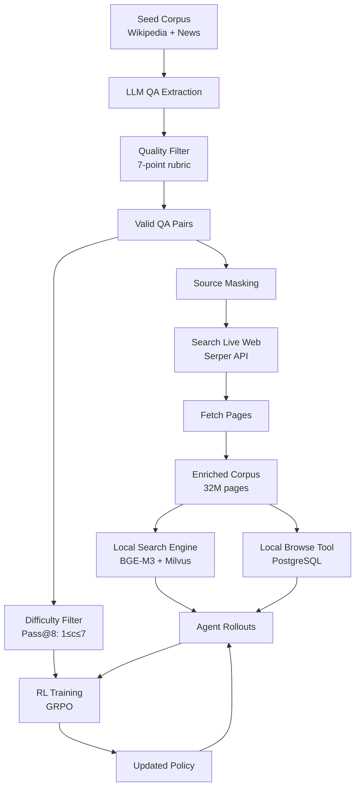

## TL;DR

LiteResearcher demonstrates that training deep research agents via reinforcement learning becomes tractable when decoupled from the live internet through a virtual environment that mirrors real web dynamics. The framework trains a 4B parameter agent entirely offline using synthetic tasks and a 32M-page local corpus, achieving 71.3% on GAIA and 78.0% on Xbench—matching or exceeding commercial systems like Claude-4.5-Sonnet while using 8× fewer parameters than comparable open-source models.

## Why this matters

Current approaches to training agentic deep research models face a fundamental scalability crisis. Systems that train directly on the live internet incur prohibitive costs ($59K-$243K for a single RL run) and suffer from non-deterministic rewards due to network latency, website changes, and API failures. Meanwhile, local retrieval systems constrained to Wikipedia or similar narrow corpora fail to capture the diverse search patterns required for real-world information seeking—they can teach an agent to follow citations but not to cross-verify claims across multiple domains or enumerate entities from disparate sources.

This work resolves the impasse by constructing a virtual training environment that maintains the structural complexity of the open web while eliminating its operational volatility. The key insight is that search capability emerges not from handcrafted reasoning templates but from scale and diversity of information sources. By continuously expanding a local corpus with real web pages fetched during data synthesis, the system creates search dynamics sufficiently rich to develop genuine research skills that transfer to online environments.

The practical implications are significant: a 4B parameter model trained entirely offline at zero marginal cost can now match commercial APIs that are 100× larger. This suggests that the data-environment bottleneck has been constraining agent performance more than model scale, and that on-device deep research agents are now feasible.

## Background

The paper builds on three key developments in agent training. **DeepSeek-R1** established that reinforcement learning with verifiable rewards (RLVR) can internalize complex reasoning behaviors like self-verification directly into model weights, moving beyond inference-time prompting tricks. **ReAct framework** provides the standard agent architecture where models alternate between generating reasoning thoughts, executing tool actions, and incorporating observations into their context. **GRPO (Group Relative Policy Optimization)** offers a stable RL algorithm that normalizes advantages within rollout batches, avoiding the high variance that plagued earlier policy gradient methods in long-horizon tasks.

Prerequisites for understanding this work include familiarity with standard RL concepts (policy gradients, on-policy vs off-policy training), retrieval-augmented generation systems (dense/sparse retrieval, vector databases), and the basic agent loop where LLMs invoke external tools through structured action spaces.

## The core idea

The central insight is treating deep research training as a virtual world construction problem rather than a live interaction problem. Think of it like training a pilot: instead of putting trainees directly in expensive aircraft that could crash, we build high-fidelity flight simulators that reproduce the essential dynamics while maintaining complete control over the environment.

The system co-evolves three components in a virtuous cycle. First, it generates synthetic question-answer pairs from seed content, deliberately masking the original sources to prevent trivial lookups. Second, for each validated QA pair, it fetches related real web pages from the internet and adds them to a local corpus. Third, this enriched corpus powers local search and browse tools that provide deterministic, low-latency interactions during RL training. The agent learns to solve increasingly complex research tasks in this controlled environment, developing search strategies that transfer seamlessly to the live web because the local corpus maintains the same diversity and interconnection patterns as the internet itself.

## The method

### Problem Formulation

The system models deep research as a Markov Decision Process where an agent with policy $\pi_\theta$ interacts with an environment over multiple timesteps. Given an initial query $q$, the agent maintains a history:

$$H_t = (q, \tau_1, a_1, o_1, ..., \tau_t, a_t, o_t)$$

where $\tau_i$ represents reasoning thoughts, $a_i$ represents actions, and $o_i$ represents environmental observations. At each step, the agent generates:

$$\tau_t \sim \pi_\theta(\cdot | H_{t-1}), \quad a_t \sim \pi_\theta(\cdot | H_{t-1}, \tau_t)$$

The action space consists of two primitives:
- `Search(query)`: Returns ranked snippets and URLs from the search engine
- `Browse(url, query)`: Returns a query-conditioned summary of page content

### Data Synthesis Pipeline

The framework generates training data through a multi-stage pipeline:

1. **QA Extraction**: An LLM processes Wikipedia and news articles to extract factual QA pairs targeting specific entities (dates, names, statistics). Each pair must satisfy seven strict criteria including answer verifiability, question independence, and temporal specificity.

2. **Source Masking**: After generating a QA pair, the system deletes its source document from the local corpus, forcing the agent to discover alternative search paths.

3. **Multi-hop Synthesis**: A separate graph-based pipeline builds knowledge graphs from web evidence, samples connected subgraphs, and generates backward questions requiring 3-5 hop reasoning along graph edges.

4. **Corpus Expansion**: For each validated QA pair, the system queries Serper API to fetch ~100 related web pages, which are deduplicated, converted to Markdown, and added to the local corpus. This iterative process expanded the corpus from 10M to 32M pages over two iterations.

### Local Tool Environment

The enriched corpus powers two local services:

**Local Search Engine**: Uses BGE-M3 embeddings for hybrid retrieval, combining dense (1024-d) and learned sparse representations. Pages are indexed at document level (not chunked) in Milvus with DiskANN, achieving ~0.15s/query latency (10× faster than online search).

**Local Browse Tool**: Stores full Markdown content in PostgreSQL keyed by URL, configured for 1000 concurrent connections, returning pages at ~0.17s/page (46× faster than Jina Reader).

### Reinforcement Learning

Training employs Group Relative Policy Optimization (GRPO) with strictly on-policy updates:

$$J_{GRPO}(\theta) = \mathbb{E}_{q \sim P(Q), \{o_i\}_{i=1}^K \sim \pi_{\theta_{old}}} \left[ \frac{1}{K} \sum_{i=1}^K \min\left( r_i(\theta)A_i, \text{clip}(r_i(\theta), 1-\epsilon_{low}, 1+\epsilon_{high})A_i \right) \right]$$

where $r_i(\theta) = \frac{\pi_\theta(o_i|q)}{\pi_{\theta_{rollout}}(o_i|q)}$ is the probability ratio and $A_i$ is the advantage normalized within the batch of K=8 rollouts per query.

Key training parameters:
- Global batch size: 128 queries
- Learning rate: $1 \times 10^{-6}$ (constant)
- Max response length: 32K tokens (Stage 1) → 48K tokens (Stage 2)
- Sampling temperature: 0.7 (Stage 1) → 1.0 (Stage 2)
- No KL penalty or entropy regularization

### Curriculum Learning

The framework implements difficulty-aware data filtering to prevent training saturation. Before each stage, it evaluates each query with K=8 rollouts and retains only those where the number of correct responses $c$ satisfies $1 \leq c \leq 7$. Queries with $c=8$ are discarded as trivial, while $c=0$ indicates impossible or excessively noisy tasks.

Stage progression:
- **Stage 1**: 10,398 queries (73% direct QA, 27% multi-hop), max 32K tokens
- **Stage 2**: 16,199 queries (adds science domain data), max 48K tokens, adjusted complexity

## Architecture

## Results

LiteResearcher-4B achieves state-of-the-art results among open-source models across eight benchmarks. On GAIA-Text, it reaches 71.3%, matching Claude-4.5-Sonnet (71.2%) and surpassing TongyiDeepResearch-30B (70.9%). On Xbench-DeepSearch, it achieves 78.0%, the highest among all open-source models and exceeding GPT-5-high (77.8%). The model consistently outperforms AgentCPM-Explore-4B, a concurrent 4B model trained on the live internet, by substantial margins (GAIA: 71.3% vs 63.9%, Xbench: 78.0% vs 70.0%).

The most convincing experiments demonstrate the necessity of each component. Removing the synthetic data drops GAIA performance from 66.8% to 58.7%, confirming it captures diverse search patterns beyond simple multi-hop reasoning. The on-policy vs off-policy ablation shows that strictly on-policy training achieves 68.9% on GAIA versus 66.8% for off-policy, with on-policy maintaining stable improvement throughout training while off-policy gains plateau and decline.

The two-stage curriculum proves essential for continued learning: Stage 1 saturates at 64.7% GAIA accuracy, but transitioning to Stage 2 with adjusted difficulty pushes performance to 68.3% (+3.6%). The RL stage contributes +15.7 points over the SFT baseline (71.3% vs 55.6%), with the model surpassing its teacher (TongyiDeepResearch at 70.9%) despite having 7.5× fewer parameters.

## Limitations

The method's primary constraint is context window utilization. On BrowseComp, which requires exceptionally deep browsing chains (often 20+ pages), the 4B model with 128K context achieves only 20.3% accuracy, improving to 27.5% with a memory mechanism that compresses prior interactions. This suggests small-scale agents fundamentally struggle with extremely long interaction sequences regardless of training quality.

The synthetic data pipeline, while diverse, still depends on the initial seed corpus quality. Domains poorly represented in Wikipedia and news sources may not receive adequate coverage in the training distribution. The graph-based multi-hop synthesis explicitly constructs reasoning chains but may not capture all emergent search patterns that arise organically in human research.

The evaluation focuses on English and Chinese benchmarks, leaving cross-lingual transfer and low-resource language performance unexplored. The local corpus, while large at 32M pages, represents a tiny fraction of the live web and may miss rapidly changing information or highly specialized technical domains.

## Reimplementation notes

The complete training pipeline requires substantial infrastructure investment. The corpus expansion phase needs ~220K Serper API calls (~$220) and storage for 32M web pages (~1-2TB after deduplication). The local search engine requires a Milvus instance with ~200GB RAM for caching and DiskANN indexing.

Training compute totals approximately 800 H100 GPU-hours for the full pipeline (SFT + 2-stage RL with 700+ steps). The SFT stage alone uses 8 H100s for one epoch over 68K trajectories. RL training generates 73.2M tool calls over the full run, requiring hundreds of concurrent service instances.

The authors promise to open-source the complete framework including data synthesis pipelines, local environment infrastructure, and RL training code. The base model (Qwen3-4B-Thinking-2507) and teacher model (TongyiDeepResearch) are publicly available. BGE-M3 embeddings and Milvus are open-source and well-documented.

A solo engineer could likely prototype the core system in 2-3 months but would need to significantly downscale: use a smaller seed corpus (1M pages), simpler synthesis (skip multi-hop), and shorter RL training (100 steps). The main implementation challenge is the infrastructure orchestration—coordinating data synthesis, corpus expansion, service deployment, and distributed RL training.

## Production implementation

**Tech stack**: Python for orchestration, vLLM or SGLang for model serving, Milvus for vector search, PostgreSQL for document storage, Ray for distributed RL coordination. The inference runtime should use TensorRT-LLM for the 4B model to maximize throughput on edge deployments.

**Data pipeline**: Training data flows from Wikipedia dumps → LLM synthesis → Serper enrichment → local corpus. At inference time: user query → load balancer → preprocessing (length check, safety filters) → model server → tool orchestration service → response assembly → output validation. The corpus needs monthly refresh for time-sensitive information with incremental indexing to avoid full rebuilds.

**Deployment shape**: Online service with 50-100ms latency budget for reasoning steps, 200ms for tool calls. One A100 80GB handles ~20 QPS at batch size 8 for the 4B model. For cost-sensitive deployments, quantize to INT8 and serve on 2× A10G GPUs with comparable throughput.

**Failure modes in production**:
- Tool timeout cascade: Set aggressive timeouts (2s search, 5s browse) with fallback to cached results
- Context exhaustion: Implement sliding window with importance-based eviction before hitting limits  
- Hallucinated URLs: Validate all browse targets against URL regex and return graceful errors
- Search API quotas: Circuit breaker with exponential backoff, fallback to local-only search
- Adversarial queries: Rate limit per user, block patterns matching prompt injection templates

**Evaluation plan**: Offline metrics include answer accuracy on held-out test sets and tool call efficiency (unique URLs per query). Online A/B test with 5% treatment, measuring task completion rate, user satisfaction ratings, and p50/p99 latencies. Never ship if hallucination rate exceeds 5% or if the model enters infinite tool-call loops on >1% of queries.

**Rollout strategy**: Shadow mode for one week comparing against current system → 1% canary with intensive monitoring → 10% for 48 hours checking for degradation → 50/50 split for statistical significance → full rollout. Instant rollback triggers: >10% increase in timeout errors, any infinite loop detection, or user complaints about factual errors exceeding baseline by 2×.

**Cost back-of-envelope**: At $0.40/A100-hour and 20 QPS capacity, infrastructure costs ~$0.001 per query. Search API calls (if online fallback) add $0.001-0.005. Total ~$0.10 per 1K requests for pure inference. Memory and storage for 32M page corpus adds ~$500/month fixed cost. At 1M queries/day, total cost ~$3,500/month. Cost ceiling at $10K/month—first lever is to reduce rollout count from 8 to 4 for non-critical queries.

## Related reading

- **DeepSeek-R1** (Guo et al., 2025): Demonstrates that RL alone can induce complex reasoning behaviors without handcrafted Chain-of-Thought templates, establishing the RLVR paradigm this work extends to tool use.

- **WebDancer** (Wu et al., 2025): Another approach to training web agents with RL, but relies on live internet interaction, providing a direct comparison point for online vs offline training effectiveness.

- **AgentCPM-Explore** (Chen et al., 2026): Concurrent work training a 4B web agent, useful for understanding the challenges of online environment instability and reward noise that motivated the virtual world approach.

- **GRPO** (Shao et al., 2024): The core RL algorithm used here, originally developed for mathematical reasoning but adapted for long-horizon agent tasks with trajectory importance sampling corrections.

- **Milvus** (Wang et al., 2021): The vector database powering the local search engine, important for understanding the infrastructure requirements and indexing strategies at scale.

## Key equations

**Agent policy sampling**: $\tau_t \sim \pi_\theta(\cdot | H_{t-1}), \quad a_t \sim \pi_\theta(\cdot | H_{t-1}, \tau_t)$ — Defines how the agent generates interleaved thoughts and actions conditioned on interaction history.

**GRPO objective**: $J_{GRPO}(\theta) = \mathbb{E}\left[ \frac{1}{K} \sum_{i=1}^K \min\left( r_i(\theta)A_i, \text{clip}(r_i(\theta), 1-\epsilon, 1+\epsilon)A_i \right) \right]$ — The clipped surrogate loss that stabilizes policy gradient training in long-horizon tasks.

**Difficulty filtering criterion**: $1 \leq c \leq 7$ where $c$ is correct responses in K=8 rollouts — Ensures training data remains in the zone of proximal development.

**Probability ratio**: $r_i(\theta) = \frac{\pi_\theta(o_i|q)}{\pi_{\theta_{rollout}}(o_i|q)}$ — Corrects for distribution mismatch between rollout and training engines.