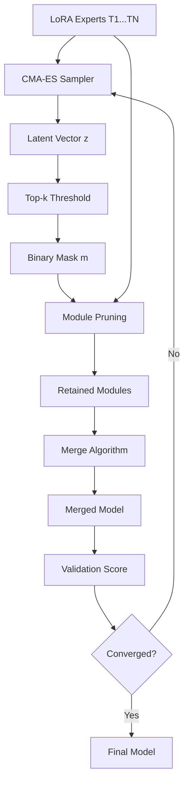

## TL;DR

LoRA model merging fails because certain adapter modules actively harm performance when combined. This paper introduces ENMP, an evolutionary search method that identifies and removes these "negative modules" before merging, achieving 3-7% accuracy gains across NLP and vision benchmarks. The method works as a plug-and-play enhancement for existing merging algorithms.

## Why this matters

The proliferation of task-specific LoRA adapters has created a practical deployment nightmare: organizations maintain dozens of specialized models for different tasks, each requiring separate inference infrastructure. Model merging promises to consolidate these into a single multi-task model, but current methods assume all LoRA modules contribute positively - a dangerous oversimplification.

This work exposes a critical flaw in that assumption. Through systematic analysis, the authors demonstrate that specific LoRA layers actively introduce interference when merged, degrading overall performance. Some tasks like QNLI see catastrophic 20%+ accuracy drops with standard merging. By introducing selective module pruning, ENMP recovers much of this lost capability while maintaining the deployment simplicity of a single model.

The impact extends beyond academic benchmarks. For production systems serving multiple specialized tasks (customer support, content moderation, translation), this enables genuine model consolidation without the typical accuracy penalties. The method integrates cleanly with existing merging algorithms, making it immediately applicable to deployed systems.

## Background

**LoRA (Low-Rank Adaptation)**: Decomposes weight updates into two small matrices $BA$ where $B \in \mathbb{R}^{d_{out} \times r}$ and $A \in \mathbb{R}^{r \times d_{in}}$ with rank $r \ll \min(d_{in}, d_{out})$. This reduces trainable parameters by 10,000x while maintaining fine-tuning quality.

**Task Arithmetic (Ilharco et al., 2023)**: Established that model weight differences encode "task vectors" that can be arithmetically combined - adding vectors merges capabilities, subtracting removes them.

**TIES-Merging (Yadav et al., 2023)**: Improved basic averaging by resolving sign conflicts between parameters and pruning low-magnitude updates that likely represent noise.

**KnOTS (Stoica et al., 2025)**: Addresses LoRA-specific merging challenges by aligning disparate low-rank subspaces via SVD before combining, recognizing that independently trained adapters occupy incompatible geometric spaces.

## The core idea

Imagine merging teams where some members actively sabotage the group's work. Current merging methods try to harmonize everyone through clever coordination (alignment, interpolation). ENMP takes a different approach: identify the troublemakers and exclude them entirely.

The insight comes from a simple experiment: remove one LoRA module at a time and check if the merged model improves. Surprisingly, removing certain layers consistently *increases* accuracy - these "negative modules" introduce more interference than useful knowledge. The challenge is that negative modules aren't independent; removing one can make another beneficial or harmful. This creates a complex combinatorial optimization problem that greedy approaches fail to solve.

The solution uses evolutionary search (CMA-ES) to navigate this interdependent landscape, learning which combinations of modules to prune for optimal collective performance.

## The method

### Problem Formulation

Given $T$ task-specific LoRA adapters $\mathcal{T} = \{\Delta W_1, ..., \Delta W_T\}$, the goal is to merge them into a single model. Each adapter modifies $L$ transformer layers, creating $N = L \times T$ total pruning units.

A binary mask $m \in \{0,1\}^{L \times T}$ determines which modules to retain ($m_{l,t} = 0$) or prune ($m_{l,t} = 1$). The merged weight at layer $l$ becomes:

$$W_{ENMP}^{(l)}(m) = W_0^{(l)} + \lambda \cdot \Phi(S^{(l)}(m))$$

where $S^{(l)}(m) = \{\Delta W_t^{(l)} | m_{l,t} = 0\}$ contains retained modules and $\Phi$ is any aggregation function (Task Arithmetic, TIES, etc.).

The optimization objective:
$$m^* = \arg\max_{m \in \{0,1\}^{L \times T}} \mathcal{M}(W_{ENMP}(m); D_{val})$$

where $\mathcal{M}$ measures validation performance (normalized accuracy across tasks).

### Evolutionary Search with CMA-ES

Direct optimization over $2^N$ binary masks is intractable. ENMP maps the discrete problem to continuous latent space using CMA-ES:

1. **Latent representation**: Each module gets a continuous "negativity score" $z_j \in \mathbb{R}$
2. **Population sampling**: Generate candidates from multivariate Gaussian $\mathcal{N}(\mu^{(g)}, (\sigma^{(g)})^2 C^{(g)})$
3. **Mask mapping**: Convert scores to binary via dynamic thresholding:
   - Select top-$k$ highest scores (where $k = \lfloor \rho \cdot N \rfloor$ for maximum pruning ratio $\rho$)
   - Prune if $z_j > 0$ and in top-$k$

```python
# Pseudocode for ENMP optimization
def ENMP_search(lora_experts, val_data, generations=60):
    # Initialize CMA-ES
    mu = -1 * ones(N)  # Conservative: start with no pruning
    sigma = 0.5
    C = identity(N)
    
    for g in range(generations):
        # Sample population
        candidates = []
        for i in range(pop_size=16):
            z = sample_multivariate_normal(mu, sigma^2 * C)
            
            # Convert to binary mask
            mask = top_k_threshold(z, max_prune_ratio=0.2)
            
            # Evaluate merged model
            merged = merge_with_mask(lora_experts, mask)
            score = evaluate(merged, val_data)
            candidates.append((z, score))
        
        # Update distribution toward best candidates
        mu, C, sigma = cma_update(candidates)
    
    return best_mask
```

### Key Design Choices

**Module granularity**: Treats all attention projections (Q, K, V, O) within a layer as atomic units. This preserves attention mechanism coherence - pruning partial components breaks semantic consistency.

**Conservative initialization** ($\mu^{(0)} = -1$): Starts from full merging state since negative initialization prevents premature pruning ($z_j > 0$ required).

**Adaptive sparsity**: Maximum ratio $\rho$ acts as upper bound, not target. Algorithm typically prunes ~16% of modules regardless of allowed budget, suggesting natural sparsity level.

**Hyperparameters**:
- Population size: 16 candidates per generation
- Generations: 60 (converges in ~10 for 90% of gains)
- Initial step size $\sigma$: 0.5
- Maximum pruning ratio $\rho$: 0.2
- Rank $r$: 16, scaling factor $\alpha$: 16 for LoRA

## Architecture



## Results

The method delivers consistent improvements across all tested merging algorithms. On NLP tasks (Llama-3-8B), ENMP boosts Task Arithmetic by 3.24%, TIES by 6.40%, and DARE by 6.97% in normalized accuracy. The gains are particularly dramatic for sensitive tasks - QNLI sees recovery from ~70% to ~95% accuracy.

Vision experiments (ViT-B/32) confirm cross-modal generalization with average improvements of 1.67-5.54% across different baselines. The strongest results come when combined with subspace alignment methods like KnOTS (+4.82% NLP, +5.54% vision), suggesting complementary mechanisms.

The most convincing evidence comes from the ablation against random pruning. Random removal at matched sparsity (16.7%) actually *decreases* accuracy by 1.15%, while ENMP's targeted pruning increases it by 3.24%. This proves the gains come from precise interference localization, not mere sparsification.

Convergence analysis reveals practical efficiency: 90% of accuracy gains materialize within 10 generations (~23 minutes), with full convergence at 60 generations (~2.3 hours on 8x RTX 4090).

## Limitations

The method assumes access to validation data for fitness evaluation, which may not exist for truly zero-shot scenarios. While most baselines also require validation data for hyperparameter tuning, this remains a deployment constraint.

Computational overhead scales poorly with model size and task count. The current implementation requires ~2.3 GPU-hours for 8B parameter models with 6 tasks. Scaling to 70B+ models with hundreds of tasks would require more efficient search strategies or approximations.

The paper doesn't explore failure modes where pruning hurts performance. What if tasks require fundamentally incompatible representations? The fixed module granularity (full attention blocks) might be too coarse for some interference patterns.

Evaluation focuses on relatively similar tasks (all NLI for language). Real-world deployment often involves radically different capabilities (coding vs. translation vs. reasoning) where interference patterns could be more complex.

## Reimplementation notes

The authors provide code at `https://github.com/CaoAnda/ENMP-LoRAMerging` with pre-trained LoRA checkpoints from prior work.

**Critical implementation details**:
- Module boundaries must align with attention blocks (Q/K/V/O together)
- CMA-ES requires careful initialization - starting from wrong distribution fails catastrophically
- Validation set can be small (64 samples/task sufficient) but must be representative

**Compute requirements**: 
- ~2.3 GPU-hours on 8x RTX 4090 for full convergence
- ~$5-10 cloud compute cost per merging operation
- Memory: fits on single 24GB GPU for 8B models

**Effort estimate**: 3-5 days for experienced engineer to replicate core results given existing CMA-ES library and pretrained LoRAs. Main complexity in correctly implementing mask mapping and integration with various merging algorithms.

## Production implementation

**Tech stack**: Python service with vLLM for inference, Ray for distributed CMA-ES evaluation, Redis for caching pruning masks, PostgreSQL for experiment tracking. PyTorch for merging operations.

**Data pipeline**: 
- Training: Pull task-specific datasets from S3, version with DVC
- Merging: Sample stratified validation sets (1K examples/task), store in PostgreSQL
- Inference: Request → Load merged weights from model registry → vLLM inference → Response

**Deployment shape**: Batch job for mask discovery (one-time, ~3 hours), then standard model serving. Target: 100 QPS on 2× A100 80GB for 8B model at batch size 32. Pruning adds zero inference overhead - final model identical to standard architecture.

**Failure modes in production**:
- **Task drift**: Monitor per-task accuracy degradation. If any task drops >5%, trigger re-optimization
- **Validation overfitting**: Hold out separate test set, alert if val-test gap exceeds 3%
- **Catastrophic interference**: New task causes existing capabilities to collapse. Detect via canary deployments with automatic rollback
- **Search divergence**: CMA-ES fails to converge. Implement early stopping with fallback to greedy pruning

**Evaluation plan**:
- Offline: Unit tests for mask validity, integration tests for each merging algorithm
- Online: A/B test with 5% traffic, measure task-specific success rates
- Never ship: >2% degradation on any production-critical task

**Rollout strategy**: 
1. Shadow mode for 1 week, log predictions without serving
2. 5% traffic canary with per-task monitoring
3. Ramp 5% → 25% → 50% → 100% over 2 weeks
4. Rollback trigger: any task accuracy drops >3% or P99 latency increases >20%

**Cost back-of-envelope**: 
- One-time merging: ~$10 compute
- Inference: ~$0.002 per 1K tokens (matches single model cost)
- Break-even vs. multi-model deployment at >3 tasks due to memory savings

## Related reading

- **Task Arithmetic (Ilharco et al., 2023)**: Foundational work establishing weight-space operations for capability manipulation
- **TIES-Merging (Yadav et al., 2023)**: Sign conflict resolution and magnitude-based pruning for parameter merging
- **LoRA (Hu et al., 2022)**: The low-rank adaptation method that enables parameter-efficient fine-tuning
- **KnOTS (Stoica et al., 2025)**: Subspace alignment approach specifically designed for LoRA merger challenges
- **CMA-ES Tutorial (Hansen, 2016)**: Comprehensive guide to the covariance matrix adaptation evolution strategy used for optimization

## Key equations

**Merged weight with pruning**: $W_{ENMP}^{(l)} = W_0^{(l)} + \lambda \cdot \Phi(S^{(l)}(m))$ - Core formulation combining base weights with filtered task updates

**Mask mapping function**: $m_j = 1 \text{ if } j \in \text{top-k}(z) \land z_j > 0$ - Converts continuous scores to discrete pruning decisions

**CMA-ES sampling**: $z_i \sim \mathcal{N}(\mu^{(g)}, (\sigma^{(g)})^2 C^{(g)})$ - Adaptive multivariate Gaussian for exploring pruning configurations

**Normalized accuracy metric**: $\text{NormAcc}^{(t)} = \text{Acc}_{\text{merged}}^{(t)} / \text{Acc}_{\text{expert}}^{(t)}$ - Task-relative performance measure that accounts for varying difficulty