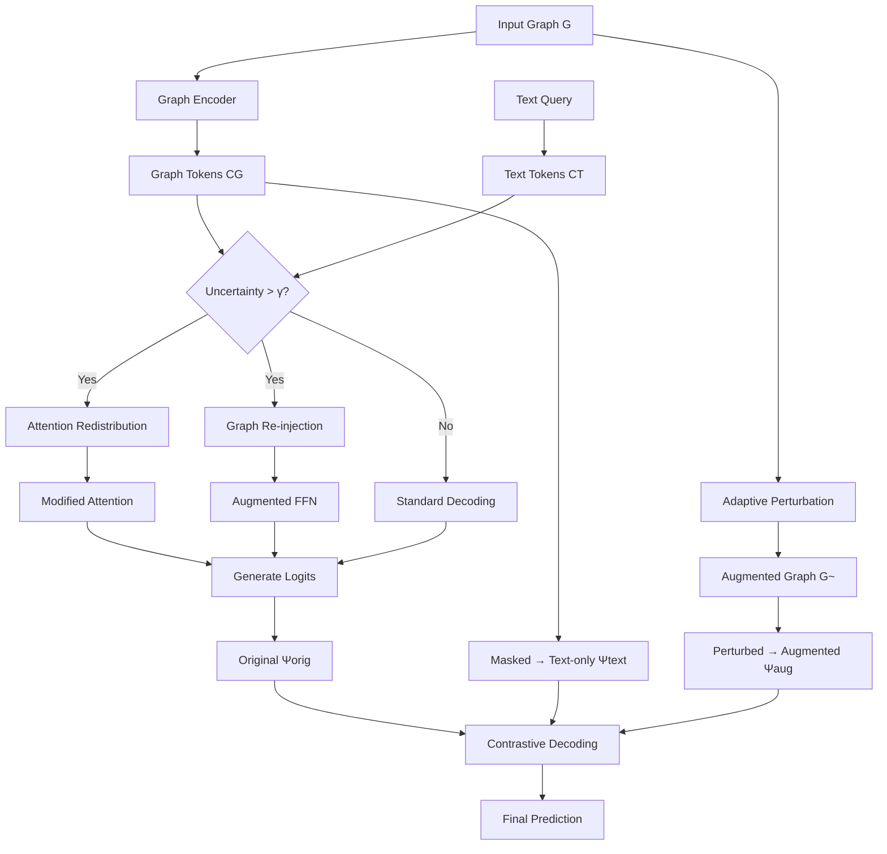

## TL;DR

Graph-enhanced LLMs struggle because they overlook graph structure during decoding, instead relying on text priors. LoReC fixes this through a three-stage training-free framework that redistributes attention to graph tokens, re-injects graph information into feed-forward layers, and uses contrastive decoding to suppress false priors. The method achieves up to 7.97% F1 improvement over state-of-the-art GraphLLM approaches without requiring fine-tuning.

## Why this matters

The integration of graph neural networks with large language models promises to unlock structured reasoning over relational data—from molecular graphs to social networks. However, current GraphLLM approaches exhibit a fundamental failure: despite encoding graph structure, models progressively ignore graph tokens during autoregressive generation, with attention to graph information dropping below 10% in deeper layers. This leads to predictions driven almost entirely by textual priors rather than graph topology.

This work provides the first systematic diagnosis of why GraphLLMs underperform and offers a practical solution that requires no retraining. The training-free nature is particularly valuable given the computational cost of fine-tuning large models on graph data. While the scope is limited to text-attributed graphs with explicit node features, the principles could extend to other structured data modalities where LLMs struggle to maintain attention on non-textual inputs.

## Background

The paper assumes familiarity with transformer attention mechanisms, particularly the autoregressive decoding process where each token attends only to previous tokens via causal masking. Understanding graph neural networks' message-passing paradigm is helpful—nodes aggregate information from neighbors iteratively to build representations.

Key prior work includes **GraphGPT** (Tang et al., 2024), which aligns graph encodings with LLM token spaces through instruction tuning, and **GraphPrompter** (Liu et al., 2024), which uses soft prompts to inject graph information. Both methods successfully encode graphs but fail to maintain graph awareness during generation. The paper also builds on **contrastive decoding** techniques from DoLa (Chuang et al., 2024), which improves factuality by contrasting predictions across model layers.

## The core idea

Think of an LLM trying to answer questions about a graph like a student taking an open-book exam who gradually stops looking at their notes. Initially, the model pays attention to both the graph structure (the "book") and the question text. But as it generates each token of its answer, it increasingly relies on what it "remembers" from pre-training rather than consulting the actual graph data in front of it.

LoReC forces the model to keep consulting its notes through three interventions: (1) **Look** - when the model becomes uncertain, explicitly redirect attention back to graph tokens; (2) **Remember** - inject graph information directly into the model's "memory" (feed-forward layers); (3) **Contrast** - generate multiple answer attempts with different levels of graph awareness and subtract out the biases. The key insight is that these interventions only activate when the model exhibits high uncertainty, making the approach computationally efficient.

## The method

### Problem formulation

Given a graph $G = (V, E, A, X)$ with nodes $V$, edges $E$, adjacency matrix $A \in \{0,1\}^{N \times N}$, and node features $X \in \mathbb{R}^{N \times F}$, the goal is to answer text queries about the graph. A GraphLLM model $M_\theta$ consists of:
- Graph encoder $f_G$ producing embeddings $Z_G = f_G(G) \in \mathbb{R}^{N \times d_g}$
- Projection to LLM token space yielding graph tokens $C_G \in \mathbb{R}^{N \times d_{llm}}$
- Text decoder with $L$ transformer layers
- Vocabulary projection head $\varsigma(\cdot)$ for next-token prediction

The model generates response $Y = \{y_1, ..., y_{max}\}$ autoregressively:

$$p(Y|G, H_T) = \prod_{t=1}^{max} p(y_t | H_G, H_T, y_{<t}; \theta)$$

### Uncertainty-triggered intervention

LoReC monitors predictive uncertainty using normalized Shannon entropy of the top-N token distribution at each layer $l$:

$$H_t^{(l)} = -\frac{1}{\log N} \sum_{i=1}^N P_\theta(i|x_{<t}, G) \log P_\theta(i|x_{<t}, G)$$

When $H_t^{(l)} > \gamma$ (threshold typically 0.75), the system triggers interventions.

### Stage 1: Look (Attention Redistribution)

When uncertainty exceeds threshold, amplify attention weights to graph tokens uniformly:

$$\tilde{e}_{t,j} = e_{t,j} + \Gamma(H_t^{(l)} > \gamma) \cdot \eta \cdot |e_{t,j}|$$

where $j \in \Omega_G$ (graph token indices), $\eta$ controls amplification strength (typically 0.1-0.2), and $\Gamma(\cdot)$ is the gating function. The modified logits are then passed through softmax to obtain redistributed attention weights.

### Stage 2: Remember (Graph Re-injection)

Feed-forward networks in transformers can be decomposed as memory retrieval:

$$\text{FFN}(x) = \sum_{i=1}^{d_m} \phi(\langle x, k_i \rangle) \cdot v_i$$

where $k_i, v_i$ are implicit key-value pairs from weight matrices $W_1, W_2$.

LoReC augments this with explicit graph memory by treating graph tokens as auxiliary key-value pairs:

$$\widetilde{\text{FFN}}(x) = (1-\alpha) \cdot \phi(xW_1)W_2 + \alpha \cdot \phi(xW_1^g)W_2^g$$

where $W_1^g, W_2^g$ are derived from graph token embeddings $C_G$, and $\alpha$ controls injection ratio (typically 0.25).

### Stage 3: Contrast (Logit Rectification)

Generate three sets of logits:
1. **Original**: $\Psi_{orig}$ from standard decoding with graph
2. **Text-only**: $\Psi_{text}$ with graph tokens masked
3. **Augmented**: $\Psi_{aug}$ using perturbed graph $\tilde{G}$

The perturbed graph uses adaptive edge dropout based on degree centrality:

$$w_{uv} = \min(\tau, \mu \cdot (1 - \tilde{s}_{uv}))$$

where $\tilde{s}_{uv}$ is normalized edge strength based on endpoint degrees, $\mu$ is dropout rate (0.2), and $\tau$ prevents over-pruning.

Final logits combine all three:

$$\Psi_{final} = \Psi_{orig} + \omega(\Psi_{orig} - \Psi_{text}) + \beta \cdot I_{gate}(\Psi_{orig} - \Psi_{aug})$$

with $\omega = 0.5$ for text de-biasing and $\beta = 1.0$ for graph de-biasing.

### Key hyperparameters

- **Entropy threshold** $\gamma = 0.75$: Triggers intervention when model is uncertain
- **Attention amplification** $\eta = 0.1-0.2$: Strength of attention redistribution  
- **Graph injection ratio** $\alpha = 0.25$: Balance between original and graph-augmented FFN
- **Contrast weights** $\omega = 0.5, \beta = 1.0$: Text and graph de-biasing strengths
- **Edge dropout** $\mu = 0.2$: Perturbation rate for augmented graph
- **Active layers**: Attention redistribution in layers 15-22, graph re-injection in layers 8-16

## Architecture

## Results

The method demonstrates consistent improvements across five benchmark datasets. On supervised tasks, LoReC-enhanced GraphGPT achieves accuracy gains of 1.78% on Arxiv and 2.48% on PubMed, with macro-F1 improvements reaching 4.24%. When applied to GraphPrompter, the framework yields up to 5.12% accuracy improvement on Citeseer.

The most convincing results come from the zero-shot transfer experiments where models trained on one dataset are tested on another. LoReC-GraphGPT improves accuracy by 2.58% when transferring from Arxiv+PubMed to Arxiv, suggesting the method genuinely enhances graph understanding rather than overfitting to specific datasets.

Ablation studies reveal that each component contributes independently: "Look" alone provides 0.85% accuracy gain, "Remember" adds 1.03%, and "Contrast" contributes 1.12%. However, the full three-stage pipeline achieves 2.58% improvement, demonstrating synergistic effects. The entropy threshold ablation shows robustness across 0.65-0.90, with optimal performance at 0.75.

## Limitations

The method assumes text-attributed graphs where nodes have meaningful textual features—it won't work for purely structural graphs without node attributes. The approach requires generating multiple forward passes (original, text-only, and augmented), increasing inference cost by approximately 3x. 

The evaluation focuses exclusively on node classification tasks, leaving graph-level prediction and link prediction unexplored. The adaptive perturbation strategy assumes degree centrality correlates with node importance, which may not hold for all graph types (e.g., regular grids or trees).

The paper doesn't evaluate on very large graphs (>1M nodes) where the full graph encoding might exceed context windows. The uncertainty-based triggering mechanism could fail for overconfident models that maintain low entropy despite making errors.

## Reimplementation notes

The authors indicate code will be available at the GitHub repository, though it wasn't accessible at time of review. Key implementation challenges:

- **Uncertainty computation**: Must track entropy at each layer during generation, requiring hooks into the model's forward pass
- **Attention intervention**: Needs access to pre-softmax attention logits, not just final weights
- **Graph perturbation**: Degree-based edge dropout must preserve graph connectivity

**Compute requirements**: Experiments used 4× H100 GPUs for GraphGPT and 2× A800 GPUs for GraphPrompter. The method adds ~45% to inference time (82.69ms vs 45.23ms per token) and ~40% memory overhead.

**Datasets**: All use standard benchmarks (Cora, Citeseer, PubMed from PyTorch Geometric; Arxiv and Products from OGB). Custom 3:1:1 train/val/test splits except for GraphGPT experiments.

**Effort estimate**: 2-3 weeks for an experienced engineer to implement from scratch, assuming familiarity with transformer internals and access to a pre-trained GraphLLM baseline.

## Production implementation

**Tech stack**: PyTorch for model serving, vLLM for efficient batched inference with custom kernels for attention modification, Redis for caching augmented graph views, PostgreSQL with pgvector extension for storing graph embeddings.

**Data pipeline**: Graph data ingested via Apache Kafka → NetworkX for preprocessing → PyTorch Geometric for encoding → Model serving via FastAPI. Graph augmentations pre-computed during data ingestion and cached. Inference flow: HTTP request → graph lookup → encode if not cached → generate with LoReC interventions → response.

**Deployment shape**: Online service with 100ms p99 latency target. Single A100 80GB handles ~50 QPS at batch size 8. Horizontal scaling via multiple replicas behind load balancer.

**Failure modes in production**:
- **Graph size explosion**: Implement sliding window attention over graph tokens when exceeding 1K nodes
- **Uncertainty calibration drift**: Monitor entropy distribution; retrigger calibration if mean shifts >2 std devs
- **Cache invalidation**: TTL-based eviction for augmented graphs; regenerate on topology changes
- **Cascading timeouts**: Circuit breaker if contrastive decoding latency exceeds 150ms; fallback to standard decoding

**Evaluation plan**: 
- Offline: Graph attention ratio, entropy statistics, contrastive delta magnitude
- Online: A/B test with 5% treatment, measuring task accuracy and user-reported answer quality
- Guardrail: Never ship if graph attention drops below 5% in any layer

**Rollout strategy**: Shadow mode for 1 week collecting entropy distributions → 5% canary with tight SLA monitoring → 25% ramp checking accuracy lift → full rollout. Rollback trigger: >10% latency regression or >5% accuracy degradation.

**Cost back-of-envelope**: ~$0.03 per 1K tokens (3x base inference cost). Cost ceiling at $0.10/1K tokens triggers disabling contrastive decoding first, then graph re-injection if needed.

## Related reading

- **GraphGPT** (Tang et al., 2024): The primary baseline—introduces instruction tuning for graph-LLM alignment but suffers from attention dilution diagnosed here.
- **DoLa** (Chuang et al., 2024): Contrastive decoding across layers for factuality—LoReC adapts this for graph-text contrast rather than layer contrast.
- **GraphPrompter** (Liu et al., 2024): Soft prompting alternative to fine-tuning—serves as the second major baseline showing similar attention decay patterns.
- **Feed-Forward Layers as Key-Value Memories** (Geva et al., 2021): Theoretical foundation for the graph re-injection mechanism's memory interpretation.
- **GOFA** (Kong et al., 2024): Concurrent work interleaving GNN and LLM layers—complementary architectural approach to the same problem.

## Key equations

**Uncertainty trigger**: $H_t^{(l)} = -\frac{1}{\log N} \sum_{i=1}^N P_\theta(i|x_{<t}, G) \log P_\theta(i|x_{<t}, G)$ — Normalized entropy determines when intervention is needed

**Attention redistribution**: $\tilde{e}_{t,j} = e_{t,j} + \eta \cdot |e_{t,j}|$ for $j \in \Omega_G$ — Amplifies graph token attention proportionally

**Graph-augmented FFN**: $\widetilde{\text{FFN}}(x) = (1-\alpha) \cdot \text{FFN}_{orig} + \alpha \cdot \text{FFN}_{graph}$ — Fuses original and graph memories

**Contrastive decoding**: $\Psi_{final} = \Psi_{orig} + \omega(\Psi_{orig} - \Psi_{text}) + \beta(\Psi_{orig} - \Psi_{aug})$ — Removes text and graph biases