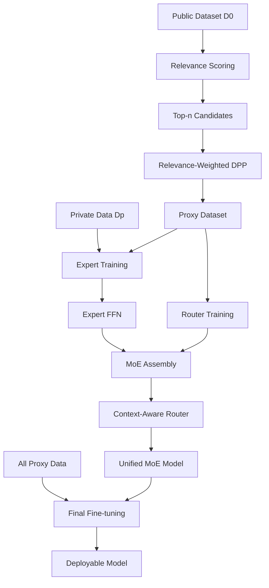

## TL;DR

Privacy-preserving MoE unification merges independently trained domain experts without sharing private data by using diversity-aware proxy selection from public data. The method selects representative public samples via relevance-weighted determinantal point processes (DPPs) to train a router that coordinates experts, achieving 1.6-2.7% accuracy gains over baselines while maintaining strict data residency.

## Why this matters

Current approaches to combining domain-specialized models face a fundamental dilemma: either centralize private training data (violating privacy constraints) or lose performance through naive parameter averaging. When organizations fine-tune models on proprietary data, the resulting experts contain valuable domain knowledge but cannot be easily unified into a deployable system. Existing federated learning solutions require costly synchronized training rounds and degrade under heterogeneous data distributions.

This work demonstrates that public proxy data, when selected carefully, can supervise effective expert coordination without accessing private data. The key insight is that proxy selection must balance relevance (similarity to private domains) and diversity (broad coverage). Prior work like FlexOlmo used similarity-only selection, producing redundant proxies that poorly represent domain distributions.

The practical impact is enabling organizations to collaborate on model development while maintaining complete data isolation—a critical requirement in healthcare, finance, and other regulated industries. Each participant trains locally, shares only final expert weights, and receives back a unified multi-domain model.

## Background

The method builds on three key foundations. **Mixture of Experts (MoE)** architectures scale model capacity by routing tokens to specialized sub-networks, enabling efficient inference by activating only relevant experts per input. **Determinantal Point Processes (DPPs)** provide a principled probabilistic framework for diverse subset selection, using kernel matrices to encode repulsive interactions between similar items. **Branch-Train-Merge** paradigms train domain experts independently then combine them post-hoc, avoiding the synchronization overhead of traditional federated learning.

Prior unification attempts include BTM (ensembles outputs without parameter sharing), ModelSoup (averages all parameters), and BTX/FlexOlmo (inserts experts into MoE layers with learned routers). The critical limitation is that routers trained without private data struggle to coordinate experts effectively.

## The core idea

Think of the problem like coordinating a team of specialists who each trained in isolation on confidential projects. You need to build a dispatcher who knows when to route tasks to which expert, but the dispatcher can only train on public examples.

The insight: carefully chosen public examples can serve as stand-ins for private data. But picking examples purely by similarity (as prior work does) is like training the dispatcher on only one type of task—it misses the full range of each expert's capabilities.

MetaMoE instead selects public samples that are both relevant (similar to each expert's domain) and diverse (spanning the full capability space). This is achieved through a relevance-weighted DPP that explicitly balances these objectives. Additionally, experts are exposed to these same proxy samples during training, aligning their behavior with what the router will see.

## The method

### Problem Setup

Consider $K$ clients, each with private dataset $D_p$ from their domain. A shared seed model $M_0$ and public dataset $D_0$ are globally accessible. Each client adapts $M_0$ to create expert $M_p$ by fine-tuning on $D_p$. The goal: unify $\{M_p\}_{p=1}^K$ into a single MoE model $M_{\text{MoE}}$ without sharing any $D_p$.

### Proxy Selection via Relevance-Weighted DPP

For each client $p$, we select proxy dataset $\hat{D}_p \subset D_0$ of size $m$ samples. Define:
- Relevance score: $g(x, D_p)$ = probability that binary classifier assigns sample $x$ to domain $D_p$ versus $D_0$
- Similarity kernel: $\kappa(x_i, x_j) = \cos(z_i, z_j)$ where $z_i$ is embedding of $x_i$ from $M_0$
- Relevance-weighted kernel: $\tilde{\kappa}(x_i, x_j) = g(x_i, D_p) \cdot \kappa(x_i, x_j) \cdot g(x_j, D_p)$

The kernel matrix becomes:
$$\tilde{L} = \text{Diag}(r) \cdot L \cdot \text{Diag}(r)$$

where $L_{ij} = \kappa(x_i, x_j)$ and $r = [g(x_1, D_p), ..., g(x_N, D_p)]$.

Proxy selection maximizes:
$$\hat{D}_p = \arg\max_{S \subseteq Z, |S|=m} \log \det(\tilde{L}_S)$$

The log-determinant objective decomposes as:
$$\log \det(\tilde{L}_S) = 2\sum_{i \in S} \log r_i + \log \det(L_S)$$

The first term encourages relevance; the second enforces diversity through DPP repulsion.

### Proxy-Aligned Expert Training

Each client fine-tunes only FFN sublayers on $D_p \cup \hat{D}_p$ while freezing other parameters. This dual exposure:
1. Preserves domain expertise from private data
- Aligns expert representations with proxy supervision used for router training

Training uses LoRA (rank 16, scaling factor 32) for 10 epochs with SGD (learning rate 0.01, momentum 0.9).

### Context-Aware Router

Standard routers use only token embeddings $z_t^{(l)}$ at layer $l$. The context-aware router creates:
$$\tilde{z}_t^{(l)} = (1-\lambda) z_t^{(l)} + \lambda z_x^{(l)}$$

where $z_x^{(l)} = \frac{1}{T}\sum_{t=1}^T z_t^{(l)}$ is the sequence-level embedding and $\lambda \in [0,1]$ is learned.

Routing distribution:
$$\pi^{(l)}(z_t^{(l)}) = \text{softmax}[\tilde{z}_t^{(l)T}e_1^{(l)}, ..., \tilde{z}_t^{(l)T}e_K^{(l)}]$$

Expert routing vectors $e_p^{(l)}$ are initialized as mean embeddings over $D_p \cup \hat{D}_p$, providing domain-aware priors.

### Final MoE Assembly

The unified model combines:
$$M_{\text{MoE}}^{(l)}(z_t^{(l)}) = \sum_{p \in \text{Top-k}(\pi^{(l)}(z_t^{(l)}))} [\pi^{(l)}(z_t^{(l)})]_p \cdot \text{FFN}_p^{(l)}(z_t^{(l)})$$

The complete model is fine-tuned on $\bigcup_{p=1}^K \hat{D}_p$ for 5 epochs (CV) or 1 epoch (NLP) using top-1 routing.

Key hyperparameters:
- Proxy candidate pool: $n = 3000$ samples
- Final proxy set: $m = 500$ samples  
- LoRA rank: 16 with scaling factor 32
- Training epochs: 10 (expert), 5/1 (router for CV/NLP)

## Architecture

## Results

MetaMoE achieves 94.52% average accuracy on CV tasks with ViT-B/32 versus 92.92% for FlexOlmo, the strongest baseline. On NLP tasks with LLaMA-3.2-3B, it reaches 74.42% versus 72.50% for FlexOlmo. The gains are consistent across model scales—ViT-B/16 shows 96.24% versus 93.53%, and LLaMA-3.1-8B achieves 81.59% versus 77.46%.

The most convincing experiments demonstrate that relevance-weighted DPP selection provides gains even when retrofitted to existing methods. Adding DPP to FlexOlmo improves its accuracy by 0.85-2.32 percentage points across tasks. Visualizations confirm that DPP-selected proxies provide broader coverage of private data manifolds compared to similarity-only selection, which clusters redundantly.

Ablations reveal critical design choices. Removing proxy-aligned training drops accuracy by 1.7-2.2%, confirming that exposing experts to router supervision data improves coordination. The context-aware router contributes 1.8-2.2% gains by reducing token-level routing collisions. Training experts solely on proxy data (no private data) causes catastrophic 40-50% accuracy drops, proving proxies provide coordination signals but cannot replace domain-specific training.

## Limitations

The method assumes public data exists with reasonable domain overlap—performance degrades when public and private domains are entirely disjoint, though less than baselines (0.74% drop versus 3.53% for FlexOlmo when ImageNet categories overlapping with client domains are removed).

The relevance scoring requires training binary classifiers for each client, adding overhead. While Cholesky updates make DPP inference efficient, the initial embedding of all public samples for similarity computation scales poorly beyond millions of candidates.

Privacy guarantees are limited to data residency—no differential privacy mechanisms protect against model inversion attacks on shared expert weights. The routing vectors have bounded sensitivity ($O(1/m)$), but sophisticated adversaries might extract limited domain characteristics.

Evaluation lacks stress tests on adversarial domain shifts or scenarios where malicious clients provide poisoned experts. The paper doesn't address how router quality degrades with increasing numbers of experts or highly imbalanced domain sizes.

## Reimplementation notes

The core challenge is efficiently computing pairwise similarities over large public datasets. Use batch matrix multiplication and store embeddings once. Cholesky updates reduce DPP selection from $O(nm^3)$ to $O(nm^2)$ but still require careful implementation.

Approximate GPU requirements: 40 hours on A100 for full CV experiments, 100 hours for NLP with LLaMA models. The relevance classifier training adds 2-3 hours per client. Public proxy selection completes in minutes once embeddings are cached.

The authors provide code at https://github.com/ws-jiang/MetaMoE. Critical dependencies include standard transformers libraries for backbone models and NumPy/SciPy for DPP computations.

A solo engineer could build a working prototype in 2-3 weeks: 1 week for DPP selection pipeline, 1 week for expert training infrastructure, 3-4 days for router assembly and debugging. The hardest parts are efficient DPP implementation and ensuring correct LoRA merging into MoE layers.

## Production implementation

**Tech stack**: PyTorch for training, vLLM for MoE serving with custom router kernel. FastAPI service layer, Redis for caching proxy embeddings, MinIO for model versioning. DPP selection runs as Airflow DAG with GPU workers.

**Data pipeline**: Public corpus embeddings pre-computed monthly and stored in Weaviate vector database. Each client submits relevance models to S3, triggering Lambda that runs DPP selection on EC2 Spot instances. Expert weights collected via gRPC with protobuf serialization. Proxy datasets cached in feature store with 30-day TTL.

**Deployment shape**: Online service on 2× A100 40GB per region, handling 50 QPS at batch 16, p99 latency <200ms. Router cached in GPU memory, experts loaded on-demand with 2-bit quantization for rare domains.

**Failure modes in production**:
- **Domain shift**: Monitor per-expert activation rates; if usage drops >50% for 24h, flag for retraining
- **Poisoned experts**: Compute embedding drift metrics; quarantine experts >3σ from baseline
- **Cold start**: Preload top-3 most-used experts based on 7-day history
- **Cost blow-up**: If activation exceeds $K/2$ experts per request consistently, fall back to ensemble mode

**Evaluation plan**: Offline—track proxy diversity (mean pairwise distance), router confusion matrix on hold-out proxies. Online—A/B test router selection accuracy against human labels (5% shadow traffic), measure user task completion as north star. Must never ship if any expert achieves <60% accuracy on its source domain.

**Rollout strategy**: Shadow mode for 7 days collecting routing decisions → 5% stochastic routing for 48h measuring task metrics → 50% ramp over 3 days with automatic rollback if error rate exceeds baseline by 2× → Full deployment with canary on 1% for regression detection.

**Cost back-of-envelope**: At 1M requests/day with 3 experts active per request, approximately $0.15/1K requests ($0.10 compute + $0.05 model storage). Cost ceiling at $0.20; first mitigation is quantizing rarely-used experts to int8.

## Related reading

- **Switch Transformers** (Fedus et al., 2022): Introduces efficient sparse MoE with top-1 routing, the architectural foundation MetaMoE builds upon
- **Branch-Train-Merge** (Li et al., 2022): Established the asynchronous expert training paradigm avoiding federated learning's synchronization costs  
- **Determinantal Point Processes for ML** (Kulesza & Taskar, 2012): Comprehensive DPP foundations and efficient inference algorithms
- **FlexOlmo** (Shi et al., 2025): Most recent privacy-preserving MoE work using similarity-based proxy selection that MetaMoE improves upon
- **LoRA** (Hu et al., 2022): Parameter-efficient fine-tuning method enabling efficient expert specialization without full model duplication

## Key equations

**Relevance-weighted kernel**: $\tilde{L} = \text{Diag}(r) \cdot L \cdot \text{Diag}(r)$ — Augments similarity with domain relevance to balance diversity and representativeness.

**DPP selection objective**: $\log \det(\tilde{L}_S) = 2\sum_{i \in S} \log r_i + \log \det(L_S)$ — Explicitly decomposes into relevance (first term) and diversity (second term).

**Context-aware routing**: $\tilde{z}_t^{(l)} = (1-\lambda) z_t^{(l)} + \lambda z_x^{(l)}$ — Blends token and sequence representations to reduce routing collisions.

**Per-sample sensitivity bound**: $\Delta_2(e) \leq 2B/m$ — Privacy guarantee showing individual samples have bounded influence independent of domain gap.