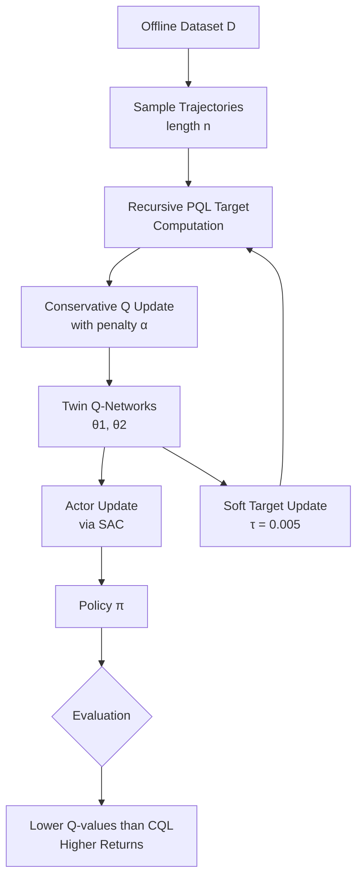

## TL;DR

Offline reinforcement learning suffers from overly conservative value estimates that prevent good performance. CPQL introduces multi-step trajectory learning using Peng's Q(λ) operator combined with conservative penalties, achieving state-of-the-art results on D4RL benchmarks. The method naturally balances between the behavior policy and learned policy, reducing over-pessimism while maintaining safety guarantees.

## Why this matters

Offline RL promises to learn control policies from static datasets without environment interaction - crucial for robotics, healthcare, and finance where online exploration is expensive or dangerous. But current methods face a painful tradeoff: conservative approaches like CQL prevent catastrophic overestimation but become so pessimistic they can't learn good policies, especially with limited data coverage.

The field has been stuck using single-step temporal difference learning, throwing away the natural trajectory structure in offline datasets. Meanwhile, online RL has shown that multi-step methods consistently outperform single-step approaches. CPQL bridges this gap by being the first to successfully adapt multi-step learning to offline settings, achieving 5-20% improvements over prior methods while being more robust to hyperparameter choices. This matters because it makes offline RL more practical - less tuning, better performance, and smoother transition to online fine-tuning.

## Background

**Conservative Q-Learning (CQL)** penalizes Q-values for out-of-distribution actions to prevent overestimation, but becomes overly pessimistic and extremely sensitive to its conservatism parameter α.

**Peng's Q(λ)** is a multi-step operator from online RL that uses exponentially-weighted returns over trajectories, converging faster than standard Bellman updates while utilizing full trajectory information.

**Distributional shift** occurs when the learned policy visits different states than the behavior policy that collected the data, causing value estimation errors to compound catastrophically.

The key insight is that multi-step operators naturally induce implicit regularization toward the behavior policy - their fixed points lie between the behavior and target policies rather than at the optimal policy. This is typically seen as a bug in online RL but becomes a feature in offline settings.

## The core idea

Think of offline RL like learning to drive from dashcam footage. Single-step methods are like looking at individual frames - you see the steering wheel position but miss the context of why the driver made that choice. Multi-step methods look at sequences - you see the whole lane change maneuver and understand the decision better.

CPQL combines this trajectory-aware learning with conservative penalties. The Peng's Q(λ) operator creates Q-values that naturally blend between the behavior policy (what the driver in the video did) and the target policy (what you're trying to learn). The parameter λ controls this blend - higher λ means staying closer to the demonstrated behavior. This implicit regularization means you need much less explicit conservatism, solving CQL's over-pessimism problem.

## The method

### Problem Setup

Consider an MDP $M = (\mathcal{S}, \mathcal{A}, P, R, d_0, \gamma)$ with states $\mathcal{S}$, actions $\mathcal{A}$, transition dynamics $P$, reward function $r$, initial distribution $d_0$, and discount $\gamma$. The offline dataset $\mathcal{D}$ contains trajectories $\{\tau_i\}_{i=1}^n$ collected by unknown behavior policies $\pi_\beta$.

The goal: learn a policy $\pi$ that maximizes expected return $J_M(\pi) = \mathbb{E}_{s \sim d_0}[V^\pi(s)]$ using only $\mathcal{D}$.

### Peng's Q(λ) Operator

The PQL operator combines n-step returns with exponential weighting:

$$T_\lambda^{\pi_\beta, \pi} Q = (1-\lambda) \sum_{n=1}^{\infty} \lambda^{n-1} T_n^{\pi_\beta, \pi} Q$$

where $T_n^{\pi_\beta, \pi} Q = (T^{\pi_\beta})^{n-1} T^\pi Q$ is the uncorrected n-step return.

**Key property**: The fixed point satisfies:
$$Q^{\pi_\beta, \pi} = (\lambda T^{\pi_\beta} + (1-\lambda) T^\pi) Q^{\pi_\beta, \pi}$$

This converges to $Q^{\lambda\pi_\beta + (1-\lambda)\pi}$ - the Q-function of a mixture policy blending behavior and target policies.

### CPQL Algorithm

The core update combines PQL with conservative penalties:

$$Q_{k+1} \in \arg\min_Q \frac{1}{2} \mathbb{E}_{s,a,s' \sim \mathcal{D}} \left[ \left( Q(s,a) - T_\lambda^{\hat{\pi}_\beta, \pi_k} \hat{Q}_k(s,a) \right)^2 \right]$$
$$+ \alpha \left( \mathbb{E}_{s \sim \mathcal{D}, a \sim \pi_k(\cdot|s)}[Q(s,a)] - \mathbb{E}_{s,a \sim \mathcal{D}}[Q(s,a)] \right)$$

The first term is the PQL TD error. The second term penalizes Q-values under the learned policy distribution minus those under the data distribution.

**Recursive target computation**: Given a partial trajectory of length $n$:
```
For i = n-1 to 0:
    Q_target[i] = r[i] + γ * Q(s[i+1], π(s[i+1])) 
                  + γλ * (Q_target[i+1] - Q(s[i+1], π(s[i+1])))
```

**Critical hyperparameters**:
- λ ∈ [0, 1): Controls mixture weight (0 = standard Bellman, 1 = pure behavior cloning)
- α > 0: Conservatism strength (typical range 0.1-10, much lower than CQL's 5-10)
- n = 5: Trajectory segment length
- Batch size: 256
- Learning rates: 3e-4 (critic), 1e-4 (actor)

The actor update uses SAC-style entropy regularization:
$$\pi_{k+1} = \arg\max_\pi \mathbb{E}_{s \sim \mathcal{D}, a \sim \pi(\cdot|s)} \left[ \min_{j=1,2} Q_{\theta_j}(s,a) - \alpha_{pol} \log \pi(a|s) \right]$$

### Architecture Choices

- **Twin Q-networks**: Two critics with minimum taken for targets (reduces overestimation)
- **Target networks**: Soft updates with τ = 0.005 (stabilizes learning)  
- **Network depth**: 3 hidden layers (256 units) for MuJoCo/Adroit, 5 layers for AntMaze
- **No entropy in Q-targets**: Unlike standard SAC, entropy bonus only in final step (prevents numerical instability with multi-step returns)

## Architecture



## Results

CPQL achieves best or near-best performance on 22 of 29 D4RL tasks, with particularly strong results on MuJoCo locomotion (average normalized score 83.5 vs 75.4 for CQL). The improvements are most pronounced on diverse datasets like random and medium-replay where trajectory information provides crucial context.

**Most convincing experiments**:
- Walker2d sensitivity analysis: CPQL maintains 80+ normalized score across α ∈ [0.1, 5] while CQL drops below 40 outside its narrow sweet spot
- Offline-to-online transition: CPQL→PQL avoids the performance cliff that CQL→SAC exhibits, maintaining monotonic improvement from the start of online training
- Custom Walker2d dataset with known behavior policy: Confirms theoretical predictions about Q-value convergence toward mixture policy

**Key ablations**:
- λ = 0 recovers CQL exactly (validates implementation)
- Higher λ reduces Q-values toward behavior policy values as predicted
- Trajectory length n = 5 vs n = 10 shows minimal difference (5 is sufficient)
- Comparison with Retrace/Tree-backup operators shows PQL's superiority without behavior policy estimation

## Limitations

CPQL struggles on extremely low-quality datasets where even the behavior policy performs poorly - here single-step methods may be preferable. The method requires storing trajectory segments rather than transitions, increasing memory by factor of n. 

The theoretical guarantees assume concentrability - that the behavior policy has sufficient coverage of optimal actions. This often doesn't hold in practice, though empirically CPQL still outperforms alternatives.

The evaluation lacks comparison with recent model-based offline RL methods and doesn't test on continuous control tasks beyond D4RL. Real-world robotics applications with high-dimensional observations (images) are not evaluated. The method hasn't been tested with very long trajectories (n > 10) where credit assignment becomes challenging.

## Reimplementation notes

**Implementation gotchas**:
- Must disable entropy bonus in intermediate Q-target computations (only at final step)
- Trajectory sampling requires maintaining episode boundaries - can't wrap across episodes
- Log-sum-exp trick for conservative penalty needs careful numerical stability

**Compute requirements**: 
- ~2-3 GPU-hours per MuJoCo task on RTX 3090
- 1M gradient steps takes ~11 hours wall time
- Memory: Storing trajectories requires ~5x single transitions

**Resources**:
- Official implementation: https://github.com/oh-lab/CPQL
- Built on CORL framework: https://github.com/tinkoff-ai/CORL
- D4RL datasets: Standard pip install

**Effort estimate**: 2-3 weeks for experienced RL engineer to replicate core results. Main challenges are trajectory buffer implementation and hyperparameter search over (α, λ) grid.

## Production implementation

**Tech stack**: PyTorch serving with TorchScript, Ray RLlib for distributed training, Redis for trajectory buffer, MLflow for experiment tracking. Triton Inference Server for model deployment with dynamic batching.

**Data pipeline**: 
- Training: Historical trajectories in Parquet files on S3, partitioned by date
- Inference: State observations → Redis queue → preprocessing (normalization, frame stacking if needed) → batch inference → action selection → post-processing (action clipping) → control command

**Deployment shape**: Online service for real-time control (robotics) or batch job for planning (supply chain). Target latency <10ms for 100Hz control loop. Single V100 16GB handles ~1000 QPS at batch size 32.

**Failure modes in production**:
- State distribution shift: Monitor KL divergence between online states and training data, fallback to behavior cloning if divergence > threshold
- Trajectory buffer corruption: Validate episode boundaries, checksums on trajectory segments
- Q-value explosion: Clip Q-values to [-1000, 1000], monitor running statistics
- Slow memory leak from trajectory storage: Ring buffer with fixed capacity, periodic garbage collection

**Evaluation plan**:
- Offline: Hold-out trajectory return, Q-value MSE on validation set
- Online: A/B test with 5% traffic, measure task success rate and safety violations
- Guardrails: Hard limits on action magnitudes, fallback to safe policy if Q-values diverge
- Never ship: Policy that increases collision rate in robotics or violation rate in trading

**Rollout strategy**: 
1. Shadow mode for 1 week, log decisions without executing
2. 1% traffic with automatic rollback if safety metrics degrade
3. Ramp 1% → 10% → 50% → 100% over 2 weeks
4. Monitor Q-value statistics - rollback trigger if variance increases 10x

**Cost back-of-envelope**: 
- Inference: ~$0.02 per 1K control decisions on AWS p3.2xlarge
- Training: ~$50 per policy update on 1M trajectory dataset
- Storage: ~$5/month per robot for trajectory buffer
- Cost ceiling at $100/robot/month - first lever is reducing trajectory length n

## Related reading

- **Conservative Q-Learning (Kumar et al., 2020)**: The single-step conservative baseline that CPQL extends with multi-step returns
- **Peng's Q(λ) for Modern RL (Kozuno et al., 2021)**: Theoretical analysis of PQL operator convergence properties and fixed points
- **Offline RL Tutorial (Levine et al., 2020)**: Comprehensive overview of distributional shift and why offline RL is hard
- **COMBO (Yu et al., 2021)**: Model-based offline RL with conservative Q-learning, complementary approach to CPQL
- **IQL (Kostrikov et al., 2022)**: Avoids querying OOD actions entirely, strong baseline that CPQL consistently outperforms

## Key equations

**PQL fixed point**: $Q^{\pi_\beta, \pi} = (\lambda T^{\pi_\beta} + (1-\lambda) T^\pi) Q^{\pi_\beta, \pi}$ - Q-values converge to mixture policy

**CPQL objective**: $\frac{1}{2}||Q - T_\lambda^{\hat{\pi}_\beta, \pi} \hat{Q}||^2 + \alpha(\mathbb{E}_\pi[Q] - \mathbb{E}_\mathcal{D}[Q])$ - Balance TD error and conservatism

**Sub-optimality bound**: $J(\pi^*) - J(\lambda\hat{\pi}_\beta + (1-\lambda)\hat{\pi}) \leq \frac{2\lambda R_{max}}{(1-\gamma)^2} \mathbb{E}[d_{TV}(\pi^*, \hat{\pi}_\beta)]$ - Performance gap depends on behavior policy quality

**Contraction rate**: $\beta = \frac{\gamma(1-\lambda)}{1-\gamma\lambda}$ - Faster convergence than Bellman operator when λ > 0